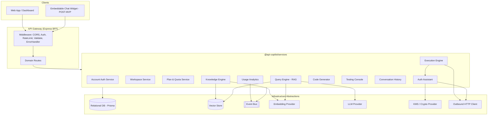
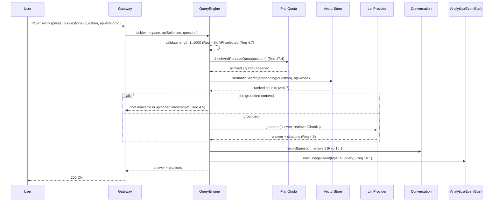

# Design Document

## Overview

API Copilot AI is an intelligent AI support engineer that ingests a REST API's OpenAPI/Swagger specification, builds a searchable knowledge base, and then answers natural-language questions, executes authenticated calls, generates client code, and (post‑MVP) diagnoses errors, produces documentation, and builds interactive demos.

This design targets the **MVP boundary** defined in the requirements while structuring components so that POST‑MVP and DEFERRED capabilities can be added without rework. The MVP delivers: user authentication and workspace management (Req 13, 14), specification upload and metadata extraction (Req 1, 2), semantic indexing and search (Req 3), natural‑language Q&A with RAG (Req 4), authenticated API execution (Req 5, 6), an interactive testing console (Req 8), code generation for Python/JavaScript/cURL (Req 7), conversation history (Req 15), an analytics dashboard (Req 16), plan/quota enforcement (Req 17), security controls (Req 18), and availability/performance targets (Req 19).

### Alignment with the Existing Monorepo

The implementation follows the established conventions of this repository so the new capability slots into the current architecture rather than introducing a parallel one:

- **Domain services** live under `packages/services/src/{domain}/` with the file set already used throughout the repo: `{domain}.service.ts`, `{domain}.types.ts`, `{domain}.errors.ts`, `{domain}.validators.ts`, `index.ts`, plus co‑located `*.test.ts` and `*.property.test.ts` files.
- **Dependency injection**: every service takes a `Partial<{Domain}Dependencies>` constructor argument supplying repositories, an event bus, an `idGenerator: () => string`, and a `dateProvider: () => Date`. Defaults fall back to in‑memory repositories, matching `RegistrationService` and `DeviceIntegrationService`.
- **Persistence** is abstracted behind repository interfaces with `InMemory*` implementations for development and test; production swaps in Prisma‑backed repositories (the repo already uses `@prisma/client`).
- **Inter‑service communication** uses the `InMemoryEventBus` / `EventBus` abstraction from `@health-checkup/shared`, wired in a composition root (`service-registry.ts`).
- **HTTP surface** is exposed through the Express BFF gateway in `packages/api-gateway`, adding one `*.routes.ts` file per domain, protected by the existing `auth`, `rate-limiter`, `request-validator`, and `error-handler` middleware and the `createRoleGuard` helper.
- **Testing** uses Jest (`ts-jest`) with `fast-check` (already a dev dependency) for property‑based tests.

> Naming note: the surrounding workspace is a health‑checkup product. This feature is a distinct product surface; its services are grouped under a dedicated set of domains (`knowledge-engine`, `query-engine`, `execution-engine`, `auth-assistant`, `code-generator`, `testing-console`, `workspace`, `account-auth`, `conversation`, `usage-analytics`, `plan-quota`) so the two products remain cleanly separable.

### Research Notes Informing the Design

- **OpenAPI/Swagger parsing**: OpenAPI 3.x and Swagger 2.0 differ structurally (e.g., `components.schemas` vs `definitions`, `requestBody` vs body `parameters`, `securitySchemes` vs `securityDefinitions`). The design normalizes both into a single internal `ApiMetadata` model so that all downstream components (search, Q&A, execution, code‑gen) are format‑agnostic. Parsing/validation is delegated to a mature library rather than hand‑rolled (candidates: `@apidevtools/swagger-parser` for validation + `$ref` dereferencing, and `@readme/openapi-parser`). This satisfies the requirement to reject invalid specs with the location/reason of the first invalid element (Req 1.4).
- **RAG + Vector search**: Semantic search requires an embedding model plus a vector store. The design abstracts both behind `EmbeddingProvider` and `VectorStore` interfaces so a local/in‑memory cosine‑similarity store can back tests while a managed vector database (e.g., pgvector, Pinecone, or OpenSearch k‑NN) backs production. Grounding (Req 4.5, 4.6) is enforced by requiring the LLM answer to cite retrieved chunks and by refusing to answer when retrieval returns nothing above the relevance threshold.
- **Credential security**: Target‑API credentials (Req 6.8) are encrypted at rest with envelope encryption (AES‑256‑GCM using a KMS‑managed data key). The `Auth_Assistant` is the sole component that can decrypt; every other component and every serialized artifact sees only ciphertext or redacted references, satisfying "not readable in plaintext through any interface or storage artifact."

## Architecture

### System Context



### Layered Responsibilities

1. **Transport layer** (`api-gateway`): HTTP concerns only — routing, authn/z, rate limiting, request validation, response shaping, TLS enforcement (Req 18.2, 18.3). Contains no business logic.
2. **Domain services** (`services`): all business rules. Pure, deterministic where possible; side‑effecting dependencies (LLM, embeddings, HTTP, crypto, clock, id) are injected so logic is unit‑ and property‑testable with fakes.
3. **Infrastructure abstractions**: interfaces (`VectorStore`, `EmbeddingProvider`, `LlmProvider`, `CryptoProvider`, `HttpClient`, repositories, `EventBus`) with in‑memory/fake implementations for tests and real adapters for production.

### Request Flow: Natural-Language Q&A (Req 4, 15, 16, 17)



### Composition Root

A single `createServiceRegistry()` (mirroring the existing gateway pattern) instantiates every service, wires shared infrastructure (event bus, DB, vector store, providers), and registers event subscriptions (e.g., analytics listening for `UsageEvent`s). The gateway stores the registry on `app.locals.services`.

## Components and Interfaces

Each component below maps to a domain folder under `packages/services/src/`. Interfaces are expressed in TypeScript to match the repo's style.

### 1. Knowledge Engine (`knowledge-engine`) — Req 1, 2, 3

Responsible for parsing specifications, normalizing to `ApiMetadata`, versioning, storage, and triggering indexing.

```typescript
interface SpecParser {
  /** Detects format, validates, dereferences $refs, and normalizes to ApiMetadata.
   *  Rejects with a ParseError carrying the location/reason of the first invalid element. */
  parse(raw: Buffer, contentType: 'yaml' | 'json'): Promise<ApiMetadata>;
}

interface KnowledgeEngine {
  uploadSpecification(input: UploadRequest): Promise<ApiVersion>;   // Req 1, 2.3
  ingestSupplementarySource(input: SupplementaryUpload): Promise<ApiMetadata>; // Req 1.9 [POST-MVP]
  selectVersion(workspaceId: string, apiId: string, version: number): ApiSelection; // Req 2.6, 2.7
}

interface IndexingService {
  index(apiVersion: ApiVersion): Promise<IndexResult>; // Req 3.1, 3.5
}
```

Key rules:
- Enforce 25 MB size and YAML/JSON format gate **before** parsing (Req 1.5).
- On parse failure, retain **no** partial metadata (Req 1.4); on storage failure, discard partial and leave workspace unchanged (Req 1.8, 2.2).
- New uploads of an existing API create a new version with a monotonically increasing number starting at 1 (Req 2.3); prior versions are immutable.
- Reject uploads that exceed the account's `Plan_Tier` API limit, leaving existing APIs unchanged (Req 2.5, 17.5).
- Indexing emits embeddings into the `VectorStore` within 60s of extraction (Req 3.1); on failure, previously indexed content is retained (Req 3.5).

### 2. Query Engine (`query-engine`) — Req 3, 4, 12, 19

Performs semantic search and RAG‑grounded answering.

```typescript
interface QueryEngine {
  semanticSearch(req: SearchRequest): Promise<SearchHit[]>;  // Req 3.2–3.4, 3.6, 3.7
  ask(req: QuestionRequest): Promise<Answer>;                // Req 4
}

interface EmbeddingProvider { embed(text: string): Promise<number[]>; }

interface VectorStore {
  upsert(items: IndexedChunk[]): Promise<void>;
  query(vector: number[], scope: ApiScope, topK: number): Promise<ScoredChunk[]>;
}

interface LlmProvider {
  generateGrounded(question: string, context: RetrievedChunk[]): Promise<GroundedAnswer>;
}
```

Key rules:
- Validate query/question length 1..1000 (Req 3.6, 4.8); reject when no API selected (Req 4.7).
- Restrict results to selected API/version scope (Req 3.3).
- Return ≤ 50 hits ranked by descending relevance; drop hits below score 0.7 (Req 3.2, 3.4).
- Answers must be grounded and must cite each source chunk (Req 4.5, 4.6). If retrieval yields nothing ≥ 0.7, return the "not available in uploaded knowledge" response and do **not** fabricate (Req 4.5).
- Endpoint‑referencing answers include path, method, and complete required‑parameter list (Req 4.2); auth questions enumerate every scheme (Req 4.3).
- Progress indication after 3s, hard timeout at 30s (Req 19.3, 19.4, 4.1).

### 3. Execution Engine (`execution-engine`) — Req 5, 8, 20

Builds and sends authenticated requests to target APIs and powers the testing console.

```typescript
interface ExecutionEngine {
  planExecution(apiSel: ApiSelection, endpointId: string, provided: ParamValues): ExecutionPlan; // Req 5.1, 5.2
  execute(plan: ExecutionPlan): Promise<ExecutionResult>;   // Req 5.3–5.7
}

interface HttpClient {
  send(req: OutboundRequest, timeoutMs: number): Promise<OutboundResponse>; // 30s (Req 5.6)
}
```

Key rules:
- Determine required path/query/body/auth params from metadata; if any missing, prompt and do **not** send (Req 5.1, 5.2).
- Return status, headers, and body; pretty‑print the body preserving structure (Req 5.3, 5.4).
- Pass through unmodified error status and body (Req 5.5).
- Distinguish timeout (Req 5.6) from network failure (Req 5.7); both retain entered values.

### 4. Auth Assistant (`auth-assistant`) — Req 6

Manages target‑API credentials and tokens; the only component able to decrypt credentials.

```typescript
interface AuthAssistant {
  supportedSchemes(): AuthScheme[]; // OAuth2, JWT, ApiKey, Bearer, Basic, ClientCredentials, PKCE (Req 6.1)
  ensureToken(target: TargetApiRef): Promise<AuthMaterial>; // Req 6.2, 6.4, 6.5, 6.6
}

interface CryptoProvider {
  encrypt(plaintext: Buffer): Promise<Ciphertext>;
  decrypt(ciphertext: Ciphertext): Promise<Buffer>;
}
```

Key rules:
- Acquire tokens with a 30s cap; on timeout/refusal/refresh failure, return a scheme‑ and target‑identifying error **without** exposing credential values (Req 6.3, 6.6, 6.7, 6.9).
- Reuse valid tokens; do not re‑acquire while valid (Req 6.4). Auto‑refresh when expired and a refresh mechanism exists (Req 6.5).
- Store credentials encrypted at rest; never surface plaintext through any interface or artifact (Req 6.8). Errors always redact.

### 5. Code Generator (`code-generator`) — Req 7

```typescript
interface CodeGenerator {
  generate(apiSel: ApiSelection, endpointId: string, language: Language): CodeSnippet; // Req 7
  supportedLanguages(): Language[];
}
```

Key rules:
- MVP languages: Python, JavaScript, cURL (Req 7.1); POST‑MVP: Java, TypeScript, C#, Go, PHP, Ruby, Kotlin, Swift, PowerShell (Req 7.2).
- Snippet includes all required params and the endpoint's auth mechanism (Req 7.3); optional params appear as commented/placeholder entries that don't break syntactic completeness (Req 7.4).
- Scoped to the selected version (Req 7.5). Errors when endpoint definition missing (Req 7.6), no valid version selected (Req 7.7), or unsupported language — listing supported languages (Req 7.8).

### 6. Testing Console (`testing-console`) — Req 8

Wraps the Execution Engine, persists request history, and replays saved requests.

```typescript
interface TestingConsole {
  run(req: ConsoleRunRequest): Promise<ConsoleRunOutcome>;   // Req 8.1, 8.2, 8.3
  replay(workspaceId: string, historyId: string): Promise<ConsoleRunOutcome>; // Req 8.4, 8.5
  exportCollection(sel: HistorySelection): PostmanCollection; // Req 8.6, 8.7 [POST-MVP]
}
```

Key rules:
- Display request (method, URL, headers, body) and response (status, headers, body, elapsed ms) on success within 30s (Req 8.1).
- On timeout/network error, stop, describe failure type, preserve params for re‑editing (Req 8.2).
- Every completed run (success or failure) is saved to a per‑workspace ring buffer capped at 500 entries, evicting the oldest (Req 8.3).
- Replay uses saved params/auth (Req 8.4); if saved auth is missing/invalid/expired, do not send and surface an auth error while retaining the saved request (Req 8.5).

### 7. Account Auth (`account-auth`) — Req 13, 18

Sign‑up, sign‑in, session lifecycle, lockout, SSO (POST‑MVP).

```typescript
interface AccountAuthService {
  signUp(req: SignUpRequest): Promise<Account>;       // Req 13.1–13.3
  signIn(req: SignInRequest): Promise<Session>;       // Req 13.4–13.6
}
```

Key rules:
- Validate email syntax, password length 8..128, required fields (Req 13.1, 13.3); reject duplicate email (Req 13.2).
- Session expires after 30 min inactivity (Req 13.4). Lock account for 15 min after 5 failed attempts within 15 min (Req 13.6).
- Passwords stored as salted hashes (never plaintext); complements encryption‑at‑rest (Req 18.1).

### 8. Workspace (`workspace`) — Req 14, 15

Workspace CRUD, isolation, membership, and access control; owns Conversation History access checks.

```typescript
interface WorkspaceService {
  create(ownerAccountId: string, name: string): Promise<Workspace>; // Req 14.1, 14.2
  authorize(userId: string, workspaceId: string): AccessDecision;   // Req 14.3, 14.4
  addMember(ownerId: string, workspaceId: string, userId: string): Promise<void>; // Req 14.5, 14.6
  removeMember(ownerId: string, workspaceId: string, userId: string): Promise<void>; // Req 14.7
}
```

Key rules:
- Name length 1..100 (Req 14.1, 14.2). Isolation: only owner + authorized members access APIs, conversations, settings (Req 14.3); unauthorized access denied with no data change (Req 14.4).
- Membership additions capped by tier member limit (Req 14.5, 14.6). Removal revokes access but retains data (Req 14.7).

### 9. Conversation History (`conversation`) — Req 15

```typescript
interface ConversationService {
  record(entry: NewConversationEntry): Promise<ConversationEntry>; // Req 15.1, 15.2, 15.6
  list(workspaceId: string, requester: UserRef): Promise<ConversationEntry[]>; // Req 15.3–15.5
}
```

Key rules:
- Record within 2s (Req 15.1); on failure, surface a save error but preserve the answer for display (Req 15.2).
- List ordered most‑recent‑first (Req 15.3); empty list without error when none (Req 15.5); deny unauthorized readers disclosing nothing (Req 15.4). Each entry carries submitting user identity and answer timestamp (Req 15.6). Retain ≥ 365 days (Req 15.7).

### 10. Usage Analytics (`usage-analytics`) — Req 16

Event‑sourced counters fed by the event bus.

```typescript
interface AnalyticsService {
  recordUsage(event: UsageEvent): Promise<void>;             // Req 16.1, 16.2
  dashboard(workspaceId: string, requester: UserRef): Promise<DashboardView>; // Req 16.3–16.7
}
```

Key rules:
- Tag events with workspace id, type, timestamp (Req 16.1). Retry recording ≤ 3 times, then drop without blocking the originating operation (Req 16.2).
- Dashboard shows counts within 3s (Req 16.3); zeros + "no usage data" when empty (Req 16.4); denies unauthorized (Req 16.5); shows quota consumed vs tier limit (Req 16.6); on load failure within 3s, error + retry while retaining events (Req 16.7).

### 11. Plan & Quota (`plan-quota`) — Req 17

```typescript
interface PlanQuotaService {
  tierOf(accountId: string): PlanTier;                       // Req 17.1
  checkAndReserveQuery(accountId: string): QuotaDecision;    // Req 17.2–17.4, 17.9
  canAddApi(accountId: string): ApiLimitDecision;            // Req 17.5, 17.6
  resetBillingPeriod(accountId: string): void;               // Req 17.7
  applyTierChange(accountId: string, newTier: PlanTier): void; // Req 17.8, 17.9
}
```

Key rules:
- Exactly one tier per account (Req 17.1). Starter: 1 API / 100 queries; Pro: unlimited APIs / 10,000 queries; Enterprise: config‑record limits (Req 17.2, 17.3, 17.6).
- On reaching quota, reject further queries and leave stored count unchanged (Req 17.4). Reset to 0 on new billing period (Req 17.7). Tier upgrade applies new limits, retains count (Req 17.8); downgrade below current count applies immediately and blocks further queries (Req 17.9).

### 12. Gateway Routes & Cross-Cutting Security — Req 18, 19

- New `*.routes.ts` files per domain under `packages/api-gateway/src/routes/`, registered in `routes/index.ts` and mounted in `index.ts`.
- TLS enforced at transport; connections without transport encryption refused (Req 18.2, 18.3).
- RBAC via `createRoleGuard` (Req 18.4, 18.5). Audit logging of security‑relevant actions (Req 18.6 [POST‑MVP exposure]). Personal‑data deletion within 30 days with confirmation (Req 18.7).
- Health check endpoint underpins the 99.9% availability measurement (Req 19.1).

## Data Models

Types live in each domain's `{domain}.types.ts`. Shared cross‑domain types (e.g., `PlanTier`, `AuthScheme`) are placed in a shared module for the product.

### Normalized API Metadata (Knowledge Engine)

```typescript
type SpecFormat = 'openapi-3' | 'swagger-2';

interface ApiMetadata {
  apiId: string;
  title: string;
  sourceFormat: SpecFormat;
  endpoints: EndpointMeta[];
  authSchemes: AuthSchemeMeta[];
  rateLimits: RateLimitMeta[];
}

interface EndpointMeta {
  endpointId: string;          // stable id: `${method} ${path}`
  path: string;
  method: 'GET' | 'POST' | 'PUT' | 'PATCH' | 'DELETE' | 'HEAD' | 'OPTIONS';
  parameters: ParameterMeta[]; // path, query, header, cookie
  requestSchema?: JsonSchema;
  responseSchemas: Record<string, JsonSchema>; // keyed by status code
  responseExamples: Record<string, unknown>;
  errorCodes: string[];
  authSchemeRefs: string[];
}

interface ParameterMeta {
  name: string;
  location: 'path' | 'query' | 'header' | 'cookie' | 'body';
  required: boolean;
  schema: JsonSchema;
  example?: unknown;
}

type AuthScheme =
  | 'oauth2' | 'jwt' | 'apiKey' | 'bearer' | 'basic'
  | 'clientCredentials' | 'pkce';

interface AuthSchemeMeta { id: string; type: AuthScheme; details: Record<string, unknown>; }
```

### Versioning & Storage (Req 2)

```typescript
interface ApiVersion {
  apiId: string;
  workspaceId: string;
  version: number;             // monotonically increasing, starts at 1
  metadata: ApiMetadata;
  createdAt: Date;
}

interface ApiSelection { workspaceId: string; apiId: string; version: number; }
```

### Search & RAG

```typescript
interface IndexedChunk {
  chunkId: string;
  apiId: string;
  version: number;
  sourceRef: string;           // endpointId or doc section for citation
  text: string;
  embedding: number[];
}

interface ScoredChunk { chunk: IndexedChunk; score: number; } // 0.0..1.0

interface Answer {
  text: string;
  grounded: boolean;
  citations: string[];         // sourceRefs used (Req 4.6)
}
```

### Credentials & Tokens (Req 6)

```typescript
interface StoredCredential {
  credentialId: string;
  targetApiRef: string;
  scheme: AuthScheme;
  ciphertext: Ciphertext;      // encrypted; never plaintext at rest (Req 6.8)
}

interface AuthMaterial {
  headers: Record<string, string>; // applied to outbound request
  expiresAt?: Date;                 // drives reuse/refresh (Req 6.4, 6.5)
}
```

### Execution & Console

```typescript
interface ExecutionResult {
  statusCode: number;
  headers: Record<string, string>;
  body: string;                // pretty-printed, structure preserved (Req 5.4)
  elapsedMs: number;
  outcome: 'success' | 'error' | 'timeout' | 'network_error';
}

interface HistoryEntry {
  historyId: string;
  workspaceId: string;
  request: OutboundRequestSnapshot;
  result: ExecutionResult;
  createdAt: Date;
}
```

### Accounts, Workspaces, Conversations, Usage, Plans

```typescript
type PlanTier = 'starter' | 'pro' | 'enterprise';

interface Account { accountId: string; email: string; passwordHash: string; tier: PlanTier; }

interface Session { sessionId: string; accountId: string; issuedAt: Date; lastActivityAt: Date; expiresAt: Date; }

interface Workspace { workspaceId: string; ownerAccountId: string; name: string; memberUserIds: string[]; }

interface ConversationEntry {
  entryId: string; workspaceId: string; userId: string;
  question: string; answer: Answer; answeredAt: Date;
}

type UsageEventType = 'ai_query' | 'api_execution' | 'code_generation';
interface UsageEvent { workspaceId: string; type: UsageEventType; timestamp: Date; }

interface QuotaState { accountId: string; billingPeriodStart: Date; queryCount: number; }
```

## Correctness Properties

*A property is a characteristic or behavior that should hold true across all valid executions of a system — essentially, a formal statement about what the system should do. Properties serve as the bridge between human-readable specifications and machine-verifiable correctness guarantees.*

Each property below is universally quantified and traces to the acceptance criteria it validates. Properties were derived from the prework analysis and consolidated to remove redundancy (e.g., the many access‑control criteria collapse into one isolation property; the several credential‑error criteria collapse into one non‑exposure property). All scope is MVP unless marked POST‑MVP.

**Knowledge Engine & Metadata**

### Property 1: Metadata extraction is complete

*For any* valid OpenAPI 3.x or Swagger 2.0 specification within the size limit, every endpoint, HTTP method, parameter, request/response schema, authentication scheme, response example, error code, and rate‑limit entry present in the source appears in the extracted `ApiMetadata`.

**Validates: Requirements 1.1, 1.2, 1.3**

### Property 2: Invalid specifications are rejected with no partial state

*For any* input that is not a valid OpenAPI 3.x or Swagger 2.0 specification, the Knowledge_Engine rejects the upload, stores no partial `ApiMetadata`, and leaves the owning Workspace unchanged.

**Validates: Requirements 1.4**

### Property 3: Metadata storage round-trip

*For any* successfully parsed specification, storing then retrieving its metadata yields metadata equal to what was extracted, associated with the owning Workspace identifier.

**Validates: Requirements 1.7, 2.1**

### Property 4: Storage failure preserves prior state

*For any* upload whose storage step fails, the system discards the partial metadata and leaves the Workspace and all previously stored versions of that API exactly as they were before the upload.

**Validates: Requirements 1.8, 2.2**

### Property 5: Version numbering is a retained, increasing sequence

*For any* sequence of k successful uploads of the same API, the stored versions are numbered 1..k, all prior versions remain retrievable, and version numbers strictly increase in upload order.

**Validates: Requirements 2.3**

### Property 6: Version selection persists until reselected

*For any* selected API version, subsequent question, execution, and code‑generation operations are scoped to that version until a different valid version is selected.

**Validates: Requirements 2.6, 7.5**

### Property 7: Invalid version selection retains prior scope

*For any* attempt to select a version that does not exist, the selection is rejected, the previously active version remains the scope, and an unavailable‑version error is returned; code generation under this condition produces no snippet.

**Validates: Requirements 2.7, 7.7**

### Property 8: API count never exceeds the tier limit

*For any* account at its Plan_Tier API limit, attempting to add another API is rejected, the existing set of APIs is unchanged, and a limit error is returned.

**Validates: Requirements 2.4, 2.5, 17.5**

**Semantic Search & Q&A**

### Property 9: Every indexed chunk becomes queryable

*For any* successfully extracted metadata, each generated content chunk is present in the Vector_Database and retrievable by a semantic query scoped to its API.

**Validates: Requirements 3.1**

### Property 10: Search results are scoped, thresholded, and ranked

*For any* search query over a multi‑API corpus, every returned hit belongs to the selected API scope, has relevance score ≥ 0.7, the result count is at most 50, and results are ordered by non‑increasing relevance; when no chunk scores ≥ 0.7 the result set is empty with a "no relevant content" message.

**Validates: Requirements 3.2, 3.3, 3.4**

### Property 11: Index remains intact on indexing failure

*For any* indexing operation that fails during embedding or storage, the previously indexed content is unchanged and an indexing‑failure indication is produced.

**Validates: Requirements 3.5**

### Property 12: Query and question length validation

*For any* search query or question that is empty or longer than 1000 characters, the request is rejected with a length‑constraint error and no answer is generated.

**Validates: Requirements 3.6, 4.8**

### Property 13: Answers are grounded or refused

*For any* question, when retrieval returns no chunk at or above the relevance threshold the Query_Engine returns the "not available in the uploaded API knowledge" response and generates no ungrounded content; otherwise the answer references only retrieved chunks.

**Validates: Requirements 4.1, 4.5**

### Property 14: Endpoint answers include path, method, and required parameters

*For any* answer that references a specific endpoint, the answer text contains that endpoint's path, its HTTP method, and every required parameter defined for it in the metadata.

**Validates: Requirements 4.2**

### Property 15: Authentication answers enumerate every scheme

*For any* selected API and a question about authentication, the answer names each authentication scheme defined in the metadata.

**Validates: Requirements 4.3**

### Property 16: Grounded answers cite their sources

*For any* grounded answer, the citation set is non‑empty and every citation corresponds to a chunk that was retrieved for that question.

**Validates: Requirements 4.6**

### Property 17: Questions require a selected API

*For any* question submitted when no API is selected, the request is rejected with a selection‑required error and no answer is generated.

**Validates: Requirements 4.7**

### Property 18: Generation failure preserves selection for retry

*For any* question whose answer generation fails or exceeds the 30‑second limit, an error is returned, no answer is fabricated, and the selected API state is preserved for retry.

**Validates: Requirements 4.9, 19.4**

**Execution & Authentication**

### Property 19: Execution plan requires exactly the metadata's required values

*For any* endpoint, the set of required values the Execution_Engine demands (path, query, body, and authentication) equals the required set defined by that endpoint's metadata.

**Validates: Requirements 5.1**

### Property 20: No request is sent while required values are missing

*For any* execution request missing one or more required parameter or authentication values, the Execution_Engine sends no request to the target API and prompts for each missing value.

**Validates: Requirements 5.2**

### Property 21: Response fidelity

*For any* target response (success or error), the status code and response body returned to the user (and displayed by the testing console with method, URL, headers, and elapsed milliseconds) equal the target's status code and body unmodified.

**Validates: Requirements 5.3, 5.5, 8.1**

### Property 22: Body formatting is structure-preserving

*For any* structured (JSON) response body, re‑parsing the formatted body yields a value structurally equal to the original body.

**Validates: Requirements 5.4**

### Property 23: Transient failures classify correctly and retain input

*For any* execution that times out (no response within 30s) or fails with a network error, the engine cancels/stops the request, returns an error classified as timeout or network‑connection respectively, and retains the entered parameters and authentication values.

**Validates: Requirements 5.6, 5.7, 8.2**

### Property 24: Valid tokens are reused

*For any* sequence of requests to the same target API while an obtained token remains valid, the Auth_Assistant performs exactly one token acquisition and reuses the token for the remaining requests.

**Validates: Requirements 6.4**

### Property 25: Expired tokens auto-refresh when a refresh mechanism exists

*For any* target API with an expired token and a configured refresh mechanism, the Auth_Assistant obtains a new token before the next request is sent.

**Validates: Requirements 6.5**

### Property 26: Credentials are never exposed in plaintext

*For any* stored target‑API credential, its value does not appear in plaintext in any storage artifact, serialized output, or authentication error; every authentication failure (acquisition timeout, missing refresh, refresh failure, invalid credentials) yields an error that identifies the target API, the scheme, and the reason while containing no credential value.

**Validates: Requirements 6.3, 6.6, 6.7, 6.8, 6.9**

**Code Generation**

### Property 27: Generated snippets include required parameters and authentication

*For any* endpoint and any supported language, the generated snippet includes every required parameter and the endpoint's authentication mechanism as defined in the selected version's metadata.

**Validates: Requirements 7.1, 7.3, 7.5**

### Property 28: Optional parameters appear as inert placeholders

*For any* endpoint with optional parameters, each optional parameter appears in the snippet as a commented‑out or placeholder entry, and the snippet remains syntactically complete without enabling them.

**Validates: Requirements 7.4**

### Property 29: Missing endpoint definition yields no snippet

*For any* code request whose endpoint has no definition in the metadata, no snippet is produced, any prior snippet is unchanged, and an endpoint‑unavailable error is returned.

**Validates: Requirements 7.6**

### Property 30: Unsupported languages are rejected with the supported list

*For any* requested language the Code_Generator does not support, no snippet is produced and the error lists exactly the supported languages.

**Validates: Requirements 7.8**

**Testing Console**

### Property 31: History is a bounded most-recent ring buffer

*For any* sequence of n completed runs in a Workspace, the saved history contains min(n, 500) entries and, when n > 500, exactly the 500 most recent runs with the oldest evicted.

**Validates: Requirements 8.3**

### Property 32: Replay reproduces the saved request

*For any* saved history entry with valid authentication, replaying it issues an outbound request equal to the saved request's parameters and authentication.

**Validates: Requirements 8.4**

### Property 33: Replay with unusable auth does not send

*For any* saved request whose authentication is missing, invalid, or expired, replay sends no request, returns an authentication error, and leaves the saved request unchanged.

**Validates: Requirements 8.5**

**Accounts, Workspaces, Conversations**

### Property 34: Valid sign-up creates a retrievable account

*For any* sign‑up with a syntactically valid email, a password of length 8..128, and all required fields, an account is created, is retrievable, and a creation confirmation is returned.

**Validates: Requirements 13.1**

### Property 35: Email uniqueness is enforced

*For any* sign‑up using an email already associated with an account, the sign‑up is rejected, an "already registered" error is returned, and no new account is created.

**Validates: Requirements 13.2**

### Property 36: Invalid registrations are rejected with the offending detail

*For any* sign‑up with a missing required field, malformed email, or password outside 8..128 characters, the sign‑up is rejected, no account is created, and the error identifies which detail is invalid.

**Validates: Requirements 13.3**

### Property 37: Session validity follows the inactivity rule

*For any* successful sign‑in, the established session grants access to the account's workspaces and is valid until 30 minutes elapse without activity, after which it is expired; sign‑in with non‑matching credentials establishes no session.

**Validates: Requirements 13.4, 13.5**

### Property 38: Lockout after repeated failures

*For any* account with 5 consecutive failed sign‑ins within 15 minutes, the account is locked for 15 minutes, sign‑in attempts during the lock are rejected with a locked indication, and sign‑in is accepted again only after the lock elapses.

**Validates: Requirements 13.6**

### Property 39: Workspace name length bounds

*For any* workspace‑creation request, a name of length 1..100 creates a workspace owned by the requesting account, and a name that is empty or longer than 100 characters is rejected with a name‑length error and creates no workspace.

**Validates: Requirements 14.1, 14.2**

### Property 40: Workspace isolation and access control

*For any* user and resource, access is granted if and only if the user is the Workspace owner or an authorized member (and their role permits the resource); a denied request changes no resource data and discloses no Workspace content, including Conversation_History and analytics.

**Validates: Requirements 14.3, 14.4, 15.4, 16.5, 18.4, 18.5**

### Property 41: Member count never exceeds the tier limit

*For any* Workspace at its Plan_Tier member limit, adding another member is rejected, the membership is unchanged, and a member‑limit error is returned.

**Validates: Requirements 14.5, 14.6**

### Property 42: Member removal revokes access but retains data

*For any* authorized member removed by the owner, that member is subsequently denied access to the Workspace's APIs, conversations, and settings, while all Workspace data is retained and a removal confirmation is returned.

**Validates: Requirements 14.7**

### Property 43: Conversation history round-trip and ordering

*For any* set of recorded question/answer entries in a Workspace, listing the history for an authorized member returns exactly those entries, each carrying the submitting user's identity and the answer timestamp, ordered from most recent to oldest.

**Validates: Requirements 15.1, 15.3, 15.6**

### Property 44: Record failure preserves the answer

*For any* answer whose Conversation_History recording fails, a save error is returned and the answer is still preserved for display to the requesting user without loss.

**Validates: Requirements 15.2**

**Analytics & Quota**

### Property 45: Analytics recording is bounded-retry and non-blocking

*For any* usage event whose recording fails, the system retries at most 3 times and then drops the event, without blocking or failing the originating query, execution, or code‑generation request.

**Validates: Requirements 16.2**

### Property 46: Dashboard counts match recorded usage and show quota

*For any* set of recorded usage events in a Workspace, the dashboard's AI‑query, API‑execution, and code‑generation counts equal the number of recorded events of each type, and it displays the Workspace's consumed query count against its Plan_Tier limit.

**Validates: Requirements 16.1, 16.3, 16.6**

### Property 47: Dashboard load failure preserves events

*For any* dashboard load that cannot retrieve data in time, an error indication with a retry action is shown and previously recorded usage events are retained.

**Validates: Requirements 16.7**

### Property 48: Query quota is never exceeded

*For any* account and billing period, the number of accepted AI queries never exceeds the Plan_Tier Query_Quota; once the consumed count equals the quota, further queries are rejected and the stored query count is unchanged.

**Validates: Requirements 17.4, 17.9**

### Property 49: Billing-period reset restores capacity

*For any* account whose quota was exhausted, beginning a new billing period resets the consumed query count to 0 and queries are accepted again up to the tier quota.

**Validates: Requirements 17.7**

### Property 50: Tier upgrade applies new limits and retains count

*For any* mid‑period upgrade to a higher tier, the new tier's API limit and Query_Quota take effect for the remainder of the period while the account's existing consumed query count is preserved.

**Validates: Requirements 17.8**

### Property 51: Audit entries are complete (POST-MVP exposure)

*For any* security‑relevant action, an Audit_Log entry is recorded containing the acting user, the action, the target, and the timestamp.

**Validates: Requirements 18.6**

## Error Handling

Errors follow the repository's established pattern: typed error classes per domain in `{domain}.errors.ts`, thrown by services and mapped to HTTP status codes in the route handlers (as `RegistrationService`/`registration.routes.ts` do today). The gateway's `errorHandler` middleware is the final catch‑all producing the standardized `ErrorResponse` shape `{ error: { code, message, details? } }`.

### Error Categories and Mapping

| Domain | Error class (examples) | Trigger (Req) | HTTP |
| --- | --- | --- | --- |
| Knowledge Engine | `SpecParseError` (with first‑invalid‑element location) | Req 1.4 | 422 |
| Knowledge Engine | `UnsupportedUploadError` (size/format) | Req 1.5 | 413 / 415 |
| Knowledge Engine | `NoMetadataFoundError` | Req 1.6 | 422 |
| Knowledge Engine | `MetadataStorageError` (partial discarded) | Req 1.8, 2.2 | 500 |
| Plan & Quota | `ApiLimitReachedError` | Req 2.5, 17.5 | 409 |
| Plan & Quota | `QuotaExceededError` (count unchanged) | Req 17.4, 17.9 | 429 |
| Knowledge/Query | `VersionUnavailableError` (prior selection retained) | Req 2.7, 7.7 | 409 |
| Query Engine | `InvalidQueryLengthError` | Req 3.6, 4.8 | 400 |
| Query Engine | `NoApiSelectedError` | Req 4.7 | 409 |
| Query Engine | `SearchUnavailableError` (no partial results) | Req 3.7 | 503 |
| Query Engine | `AnswerGenerationError` (selection preserved) | Req 4.9, 19.4 | 504 |
| Execution Engine | `MissingParametersError` (lists each missing) | Req 5.2 | 400 |
| Execution Engine | `ExecutionTimeoutError` / `NetworkFailureError` (values retained) | Req 5.6, 5.7 | 504 / 502 |
| Auth Assistant | `AuthError` (redacted: target + scheme + reason) | Req 6.3, 6.6, 6.7, 6.9 | 401 |
| Code Generator | `EndpointUnavailableError` / `UnsupportedLanguageError` (lists supported) | Req 7.6, 7.8 | 404 / 400 |
| Testing Console | `SavedAuthInvalidError` (request retained) | Req 8.5 | 401 |
| Account Auth | `EmailAlreadyRegisteredError` / `InvalidRegistrationError` | Req 13.2, 13.3 | 409 / 400 |
| Account Auth | `AccountLockedError` | Req 13.6 | 423 |
| Workspace/Conversation | `AuthorizationError` (no data change/disclosure) | Req 14.4, 15.4, 16.5, 18.5 | 403 |

### Cross-Cutting Error Principles

- **Atomicity on failure**: parse and storage failures leave no partial state (Req 1.4, 1.8, 2.2, 10.5, 11.2). Services perform validation and reservation before any mutation.
- **State preservation on transient failure**: timeouts, network errors, and generation failures retain user input and prior selections for retry (Req 5.6, 5.7, 4.9, 8.2, 19.4).
- **Credential redaction**: every `AuthError` is constructed so no credential value can appear in its message, `details`, logs, or serialized form (Req 6.3, 6.6, 6.7, 6.9, 6.8).
- **Non‑blocking analytics**: analytics recording failures are retried then dropped, never propagating to the originating request (Req 16.2).

## Testing Strategy

### Applicability of Property-Based Testing

This feature is strongly amenable to PBT: it contains parsers/normalizers (OpenAPI↔Swagger→`ApiMetadata`), serializers (metadata storage, reading/response formatting), ranking logic (semantic search ordering and thresholds), counter/state machines (quota, sessions, lockout, history ring buffer), and pure transformation logic (code generation). These have universal properties across large input spaces.

Parts that are **not** PBT‑appropriate and use example/integration/mock tests instead:
- LLM answer quality and embedding vectors themselves (external, non‑deterministic) — use fakes/mocks that return fixed vectors/answers and assert the surrounding grounding logic.
- TLS enforcement, KMS integration, health‑check availability (Req 18.2, 18.3, 19.1) — integration/smoke tests.
- Vector database availability behavior (Req 3.7) — mock the store to simulate unavailability.

### Dual Testing Approach

- **Unit tests** (`*.test.ts`): concrete examples, error mappings, edge cases, and route‑level integration with fake services (mirrors existing `*.service.test.ts` and middleware tests).
- **Property tests** (`*.property.test.ts`): universal properties using `fast-check`, minimum **100 iterations** each, tagged with a comment referencing the design property in the format used by the repo today:
  `// Feature: api-copilot-ai, Property N: <text>` plus `// Validates: Requirements X.Y`.
- **Integration/smoke tests**: gateway wiring, TLS, KMS, and availability checks.

Property tests inject deterministic `idGenerator`, `dateProvider`, fake `EmbeddingProvider`/`LlmProvider`/`HttpClient`/`CryptoProvider`, and in‑memory repositories/stores, exactly as `device-registration.property.test.ts` constructs isolated services.
