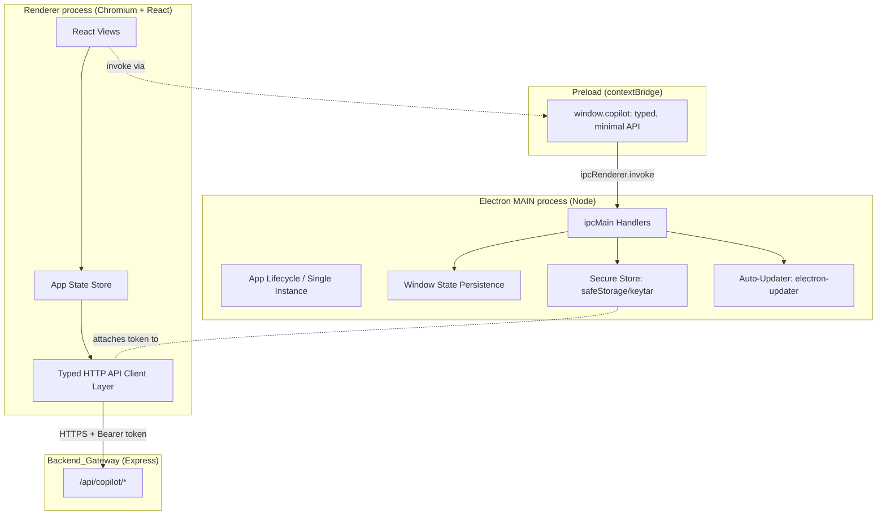
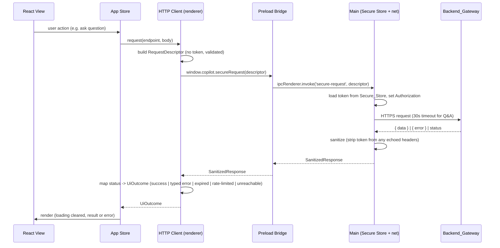

# Design Document

## Overview

API Copilot Desktop is a cross-platform desktop client for the existing **API Copilot AI** backend. It presents a graphical experience for authentication, workspace management, specification upload, metadata browsing, natural-language Q&A, semantic search, endpoint execution, an interactive testing console, code generation, conversation history, and a usage-analytics dashboard. All intelligence and persistence live in the backend; the desktop client is a **thin, well-typed presentation and orchestration layer** over the backend's HTTP surface under `/api/copilot/*` (see `packages/api-gateway/src/index.ts`).

This design covers the **[MVP] boundary** from the requirements and structures the code so the tagged **[POST-MVP]** items (additional code-generation languages, Postman export, SSO) can be added without rework. The client re-implements **none** of the backend's business rules; where the backend enforces a rule (question length, quota, workspace isolation), the client's responsibility is to *present, request, and correctly interpret* those interactions.

### Technology Stack (Decided)

The user accepted the recommended stack:

- **Electron** as the desktop shell (single codebase for Windows, macOS, Linux; native OS integration for secure storage, window management, packaging, and auto-update).
- **TypeScript + React** in the renderer for the UI.
- **electron-builder** for installers and **electron-updater** for update notification.
- **fast-check** for property-based tests, matching the repo convention (`jest.setup.fast-check.ts`, `*.property.test.ts`).

Rationale: Electron lets us reuse the backend's TypeScript request/response types directly (via `@health-checkup/services` → `apiCopilotShared`), giving a compile-checked contract between client and gateway, and provides first-class secure-storage (`safeStorage`, `keytar`), auto-update, and cross-platform packaging out of the box. Tauri was considered but rejected for MVP because it would fork the type contract into Rust and complicate reuse of the existing TypeScript types.

### Monorepo Placement

The client is added as a new workspace package: **`packages/desktop-app`**. This mirrors the existing layout (`packages/api-gateway`, `packages/frontend`, `packages/mobile-app`) and is registered in the root `package.json` `workspaces` array:

```jsonc
// root package.json
"workspaces": [
  "packages/shared",
  "packages/services",
  "packages/api-gateway",
  "packages/frontend",
  "packages/mobile-app",
  "packages/desktop-app"   // <-- added
]
```

- It depends on `@health-checkup/services` **only for its exported types** (`import type { apiCopilotShared } from '@health-checkup/services'`), never for runtime service code — the client talks to the backend over HTTP, not in-process.
- It participates in the root `npm run build --workspaces`, `npm test` (Jest), and `npm run lint` scripts. Property tests live beside sources as `*.property.test.ts` and are picked up by the existing root Jest config.
- Electron-specific build (packaging installers) is a package-local script (`npm run dist -w packages/desktop-app`) and is **not** part of the shared library build.

Internal package structure:

```
packages/desktop-app/
  package.json              # electron, electron-builder, electron-updater, react, react-dom
  electron-builder.yml      # Windows/macOS/Linux targets (Req 19)
  tsconfig.json
  src/
    main/                   # Electron MAIN process (Node) — no renderer imports
      main.ts               # app lifecycle, window creation, single instance
      window-state.ts       # window size/position persistence (Req 18.2)
      secure-store.ts       # Session_Token in OS keychain (Req 4)
      updater.ts            # auto-update / update-available notification (Req 19.4)
      ipc-handlers.ts       # ipcMain handlers for the preload bridge
    preload/
      preload.ts            # contextBridge: exposes a minimal, typed API only
    renderer/               # React app (browser context, sandboxed)
      app-client/           # typed HTTP API client layer (the focus below)
      state/                # app state store + reducers
      views/                # sign-in, workspaces, browser, qa, search, console, codegen, history, dashboard
      components/
      index.tsx
    shared-ipc/
      contract.ts           # typed IPC channel + payload definitions
  __tests__/                # (or co-located *.test.ts / *.property.test.ts)
```

### Research Notes Informing the Design

- **Electron process model & security**: The current Electron security guidance is to run the renderer with `contextIsolation: true`, `nodeIntegration: false`, and `sandbox: true`, exposing only a minimal API from a preload script via `contextBridge`. The renderer must never get direct Node or `ipcRenderer` access; instead the preload exposes named, typed functions. This design follows that model strictly (see Architecture).
- **Secret storage**: Electron ships `safeStorage` (OS-backed encryption: DPAPI on Windows, Keychain on macOS, libsecret on Linux). `keytar` is an alternative that writes directly to the OS credential vault. Either satisfies "not plaintext"; this design uses `safeStorage` to encrypt the `Session_Token` and stores the ciphertext in the user-data directory, with `keytar` as a fallback where `safeStorage.isEncryptionAvailable()` is false. Secret handling is confined to the **main** process; the renderer never sees the raw token at rest.
- **Auto-update**: `electron-updater` (companion to `electron-builder`) provides an `update-available` event usable to *notify* the user (Req 19.4) without forcing installation.
- **Backend contract**: Routes are mounted under `/api/copilot/*` and return a `{ data }` envelope on success and `{ error: { code, message, details? } }` on failure (see `api-copilot-support.ts`). Auth is a bearer `Authorization` header validated by the gateway auth middleware. Rate limiting emits `X-RateLimit-*` and `Retry-After` headers (exposed via CORS in `index.ts`). The client's HTTP layer is built directly against these facts.

## Architecture

### Process Separation and Secure IPC

Electron splits the app into a privileged **main** process (Node.js) and one **renderer** process (Chromium, running the React UI). The renderer is untrusted with OS capabilities; all privileged actions (secret storage, window state, updates, and — by design — outbound network calls that carry the token) are brokered through a **typed preload bridge**.



**Security stance (Req 4):**

- `webPreferences`: `contextIsolation: true`, `nodeIntegration: false`, `sandbox: true`, `webSecurity: true`. No remote module.
- The preload exposes a single frozen object `window.copilot` with named methods (e.g. `getBaseUrl`, `setBaseUrl`, `secureRequest`, `signOut`, `onUpdateAvailable`, `persistWindowState`). No raw `ipcRenderer`, no Node globals.
- **Token custody**: the `Session_Token` is held and attached to outbound requests in a place the renderer cannot read as plaintext. Two viable placements; this design chooses **(A) main-process request brokering**:
  - **(A)** The renderer builds a *token-less* request descriptor and calls `window.copilot.secureRequest(descriptor)`; the **main** process attaches the stored token, performs the HTTPS call, and returns the sanitized response. The renderer never holds the token. This most strongly satisfies "SHALL NOT write the Session_Token to logs/plaintext" and "no token in error messages" (Req 4.1, 16.5) because the token never enters renderer memory.
  - (B) The renderer fetches directly and asks the bridge only for the token; rejected because it puts the secret in renderer memory.
- All backend communication uses HTTPS; the client refuses non-HTTPS base URLs (Req 1.3) and refuses to transmit credentials if a secure connection cannot be established (Req 4.5, 4.6).

### Request Flow: Authenticated Backend Call (token brokering)



### Layered Responsibilities (renderer)

1. **View layer** (`views/`, `components/`): React components. Presentation only; reads from the store, dispatches intents.
2. **State layer** (`state/`): a single app store (reducer-based) holding session, connectivity, active workspace/version, per-view request status, and retained inputs. Pure reducers — unit- and property-testable.
3. **API client layer** (`app-client/`): pure functions that build `RequestDescriptor`s per endpoint and map `SanitizedResponse` → `UiOutcome`. No React, no Electron — the most PBT-amenable code.
4. **Bridge boundary** (`preload/`, `shared-ipc/`): typed IPC contract.
5. **Main services** (`main/`): secure store, window state, updater, request broker.

## Components and Interfaces

### 1. Typed HTTP API Client Layer (`renderer/app-client`) — Req 1, 2, 3, 5–15

A per-domain client whose methods map one-to-one to `/api/copilot/*` endpoints. Request/response payload types **mirror the backend** by importing `apiCopilotShared` types, so the contract is compile-checked.

```typescript
import type { apiCopilotShared } from '@health-checkup/services';

/** A token-less, transport-agnostic description of a backend call.
 *  The main process attaches auth and performs the actual HTTPS request. */
interface RequestDescriptor {
  method: 'GET' | 'POST' | 'PUT' | 'PATCH' | 'DELETE';
  path: string;                         // e.g. '/api/copilot/query-engine/questions'
  body?: unknown;                       // JSON-serializable; never contains the Session_Token
  headers?: Record<string, string>;     // never contains Authorization; broker adds it
  timeoutMs: number;                    // e.g. 30_000 for Q&A (Req 8.7)
  requiresAuth: boolean;                // broker attaches token iff true (Req 4.2)
}

/** The sanitized result the main-process broker returns to the renderer. */
interface SanitizedResponse {
  status: number;                       // HTTP status, or 0 for transport failure
  ok: boolean;
  data?: unknown;                       // parsed `{ data }` payload on success
  error?: BackendErrorBody;             // parsed `{ error }` payload on failure
  retryAfterMs?: number;                // from Retry-After on 429 (Req 16.4)
  transport: 'ok' | 'timeout' | 'unreachable' | 'tls_failed';
}

interface BackendErrorBody { code: string; message: string; details?: unknown; }

/** The renderer-facing outcome every client method returns. */
type UiOutcome<T> =
  | { kind: 'success'; value: T }
  | { kind: 'validation_error'; field?: string; message: string }  // client-side, pre-send
  | { kind: 'backend_error'; code: string; message: string; details?: unknown }
  | { kind: 'rate_limited'; retryAfterMs?: number }
  | { kind: 'session_expired' }
  | { kind: 'unreachable' }
  | { kind: 'tls_error' };
```

Each domain client is a thin object of pure builder + mapper functions:

```typescript
interface CopilotApiClient {
  account: {
    signUp(input: SignUpInput): RequestDescriptor;                 // Req 2
    signIn(input: SignInInput): RequestDescriptor;                 // Req 3
  };
  workspaces: {
    list(): RequestDescriptor;                                     // Req 5.1
    create(name: string): RequestDescriptor;                       // Req 5.2
    addMember(workspaceId: string, userId: string): RequestDescriptor; // Req 5.6 [POST-MVP gated]
  };
  planQuota: { get(accountId: string): RequestDescriptor; };       // Req 15.3
  knowledgeEngine: {
    upload(ws: string, file: UploadFile): RequestDescriptor;       // Req 6
    listApis(ws: string): RequestDescriptor;                       // Req 7.1
    selectVersion(sel: apiCopilotShared.ApiSelection): RequestDescriptor; // Req 7.2
  };
  queryEngine: {
    ask(sel: apiCopilotShared.ApiSelection, question: string): RequestDescriptor; // Req 8
    search(sel: apiCopilotShared.ApiSelection, query: string): RequestDescriptor; // Req 9
  };
  executionEngine: {
    plan(sel: apiCopilotShared.ApiSelection, endpointId: string): RequestDescriptor; // Req 11.1
    execute(plan: apiCopilotShared.ExecutionPlan, values: ParamValues): RequestDescriptor; // Req 11.3
  };
  authAssistant: {
    schemes(): RequestDescriptor;                                  // Req 10.1
    setCredential(input: CredentialInput): RequestDescriptor;      // Req 10.2
  };
  codeGenerator: {
    languages(): RequestDescriptor;                                // Req 13.1
    generate(sel: apiCopilotShared.ApiSelection, endpointId: string, language: string): RequestDescriptor; // Req 13.2
  };
  testingConsole: {
    run(input: ConsoleRunInput): RequestDescriptor;                // Req 12.1
    history(ws: string): RequestDescriptor;                        // Req 12.3
    replay(ws: string, historyId: string): RequestDescriptor;      // Req 12.4
  };
  conversations: { list(ws: string): RequestDescriptor; };         // Req 14
  usageAnalytics: { dashboard(ws: string): RequestDescriptor; };   // Req 15
}

/** Pure status→UiOutcome mapper shared by all client methods. */
function mapResponse<T>(res: SanitizedResponse): UiOutcome<T>;
```

Key rules (client-side):

- **Request construction (Req 4.2)**: builders emit descriptors with `requiresAuth` set; the broker attaches the token. `Authorization` is never set by the renderer, so the token cannot leak into renderer logs.
- **Base URL (Req 1.2, 1.3)**: paths are relative; the main process joins them with the stored HTTPS base URL. A base URL that is empty or non-HTTPS is rejected before storage.
- **Client-side validation before send** to avoid needless calls and satisfy the "reject before sending" criteria: email must contain `@` and password length 8..128 (Req 2.3); email/password non-empty for sign-in (Req 3.3); workspace name length 1..100 (Req 5.3); upload ≤ 25 MB and YAML/JSON only (Req 6.3); question/query length 1..1000 (Req 8.2, 9.4); an `Active_Workspace` required for upload (Req 6.2); an `Active_API_Version` required for Q&A/search/code-gen (Req 8.3, 13.4).
- **Status → `UiOutcome` mapping (Req 16.3, 16.4, 4.4)**: `401 (session-expired code)` → `session_expired`; `429` → `rate_limited` with `retryAfterMs`; `4xx/5xx` → `backend_error` carrying `code`+`message`; `transport: 'unreachable'` → `unreachable`; `transport: 'tls_failed'` → `tls_error`. The mapper never includes token/credential values.
- **Timeouts (Req 8.7)**: Q&A uses `timeoutMs = 30_000`; on timeout the outcome is a `backend_error`/timeout that the Q&A view renders while retaining the question text. Other calls use a default (e.g. 15s) and the dashboard treats >3s as a load failure with retry (Req 15.5).

### 2. Secure Store (`main/secure-store.ts`) — Req 4

Confined to the main process; the renderer only ever triggers store/clear via the bridge and never reads the raw token.

```typescript
interface SecureStore {
  saveToken(token: string): Promise<void>;   // encrypt via safeStorage; write ciphertext (Req 4.1)
  loadToken(): Promise<string | null>;        // used only by the request broker (Req 4.2)
  clearToken(): Promise<void>;                // sign-out / expiry (Req 4.3, 4.4)
  hasToken(): Promise<boolean>;               // startup routing (Req 1.4, 1.5)
}
```

Key rules:

- Persist only ciphertext via `safeStorage.encryptString`; fall back to `keytar` when OS encryption is unavailable. Never write the token to logs or plaintext config (Req 4.1).
- On startup, `hasToken()` decides whether to restore the session (Req 1.4) or show sign-in (Req 1.5).
- On sign-out (Req 4.3) and on a backend "expired/invalid" response (Req 4.4), the token is cleared and the app routes to sign-in.
- **Degraded mode exception (Req 17.2)**: when the backend is *unreachable*, the token is **not** cleared — only an authenticated "expired/invalid" response triggers deletion.

### 3. Request Broker (`main/ipc-handlers.ts`) — Req 4, 16, 17

The single choke point for outbound backend calls. Attaches auth, enforces HTTPS, classifies transport failures, and sanitizes responses.

```typescript
interface RequestBroker {
  secureRequest(descriptor: RequestDescriptor): Promise<SanitizedResponse>;
}
```

Key rules:

- Rejects if the base URL scheme is not HTTPS (Req 4.5, 4.6) → `transport: 'tls_failed'`, sends nothing.
- Attaches `Authorization: Bearer <token>` iff `descriptor.requiresAuth` and a token exists.
- Classifies failures: connection refused/DNS/offline → `unreachable`; deadline exceeded → `timeout`; TLS handshake failure → `tls_failed` (Req 17.1, 8.7, 4.6).
- **Sanitization invariant**: strips any `Authorization` value from echoed request metadata and guarantees the returned object contains no token/credential string (Req 4.1, 16.5).

### 4. App State Store & Navigation (`renderer/state`, `renderer/views`) — Req 1, 5, 7, 16, 17, 18

A single reducer-driven store. Pure reducers keep transitions property-testable.

```typescript
interface AppState {
  session: { status: 'signed_out' | 'signed_in'; expiredNotice: boolean };
  connectivity: 'reachable' | 'unreachable';                 // Req 17
  activeWorkspaceId: string | null;                          // Req 5.4, 18.1
  activeApiVersion: apiCopilotShared.ApiSelection | null;    // Req 7.2, 18.1
  route: ViewId;                                             // Req 18.3
  requests: Record<string, RequestStatus>;                   // per-operation loading (Req 16.1, 16.2)
  retainedInputs: Record<ViewId, unknown>;                   // input retention (Req 8.7, 11.5, 17.5)
}

type ViewId =
  | 'sign-in' | 'sign-up' | 'workspaces' | 'api-browser' | 'qa'
  | 'search' | 'testing-console' | 'code-gen' | 'history' | 'dashboard';

type RequestStatus = 'idle' | 'loading' | 'success' | 'error';
```

Key rules:

- **Loading lifecycle (Req 16.1, 16.2)**: dispatching a request sets its status `loading`; completion (success or failure) sets `success`/`error`, always clearing the loading indicator.
- **Selection preservation (Req 18.1)**: navigation changes `route` only; `activeWorkspaceId` and `activeApiVersion` persist until explicitly changed (Req 5.4, 7.2) or invalidated (a failed version select retains the prior version — Req 7.4).
- **Connectivity transitions (Req 17)**: a transport `unreachable` outcome sets `connectivity='unreachable'`, disables backend-requiring actions (Req 17.3), and keeps the session (Req 17.2); the next successful call sets `connectivity='reachable'` and re-enables actions (Req 17.4).
- **Input retention (Req 8.7, 11.5, 17.5)**: on timeout, network failure, or unreachable, the operation's input is written to `retainedInputs[view]` and a retry action is offered; a subsequent success clears it.
- **Session expiry (Req 4.4)**: a `session_expired` outcome flips `session.status='signed_out'`, sets `expiredNotice=true`, and routes to `sign-in`.

### 5. Window State & Lifecycle (`main/window-state.ts`, `main/main.ts`) — Req 18

- Persists window bounds (x, y, width, height, maximized) to the user-data directory on move/resize and restores them on launch (Req 18.2).
- **Close confirmation (Req 18.4)**: on `close`, if any request status is `loading`, `preventDefault` and ask the renderer to show a confirm dialog before quitting/aborting in-flight requests.
- Single-instance lock so window state is owned by one process.

### 6. Updater & Version (`main/updater.ts`) — Req 19

- Exposes the installed build's version identifier (from `app.getVersion()`) to a renderer "About"/status surface (Req 19.3).
- Uses `electron-updater`; on the `update-available` event it notifies the renderer via the bridge (`onUpdateAvailable`) to show a non-blocking banner (Req 19.4). MVP only *notifies*; it does not force install.

## Data Models

Payload types mirror the backend by importing `apiCopilotShared`; the models below are the **client-only** additions (form inputs and UI state). Reusing backend types keeps the request/response contract compile-checked.

```typescript
// ---- Client-side form inputs (validated before send) ----
interface SignUpInput { email: string; password: string; [field: string]: string; }
interface SignInInput { email: string; password: string; }
interface UploadFile { name: string; contentType: 'yaml' | 'json'; sizeBytes: number; bytes: Uint8Array; }
interface CredentialInput { scheme: string; values: Record<string, string>; targetApiRef: string; }
type ParamValues = Record<string, string>;
interface ConsoleRunInput { selection: apiCopilotShared.ApiSelection; endpointId: string; values: ParamValues; }

// ---- Persisted app config (non-secret) ----
interface AppConfig {
  backendBaseUrl: string | null;   // HTTPS only (Req 1.2, 1.3); never holds the token
  window: { x: number; y: number; width: number; height: number; maximized: boolean }; // Req 18.2
}

// ---- Reused from the backend (illustrative) ----
// apiCopilotShared.ApiSelection      { workspaceId, apiId, version }
// apiCopilotShared.ApiMetadata       { endpoints, authSchemes, ... }
// apiCopilotShared.ExecutionPlan     { requiredParams, requiredAuth, ... }
// apiCopilotShared.Answer            { text, grounded, citations }
// apiCopilotShared.UserRef           { userId, accountId }
```

The `Session_Token` is deliberately **absent** from every renderer-visible model; it exists only inside `SecureStore` ciphertext and transiently inside the main-process broker (Req 4.1).

## Correctness Properties

*A property is a characteristic or behavior that should hold true across all valid executions of a system — essentially, a formal statement about what the system should do. Properties serve as the bridge between human-readable specifications and machine-verifiable correctness guarantees.*

These properties target the **client's own logic**: request construction, token custody, response→UI mapping, state transitions, and input retention. Backend rules (parsing, quota, isolation) are the backend's properties and are not re-tested here. LLM/answer quality, TLS handshakes, packaging, and OS launch are not property-testable and are covered by example/integration/smoke tests (see Testing Strategy). Properties were derived from the prework and consolidated to remove redundancy (many per-endpoint criteria collapse into single parameterized properties, and every "no secret" criterion collapses into one leak property).

### Property 1: Startup routing is a total function of stored state

*For any* combination of (Session_Token present or absent) and (configured HTTPS base URL present or absent), the startup router returns exactly one destination view — base-URL prompt when no base URL is configured, the authenticated home view when a token is present, and the sign-in view otherwise.

**Validates: Requirements 1.1, 1.4, 1.5**

### Property 2: Base URL is accepted, stored, and used iff it is HTTPS

*For any* candidate base-URL string, it is accepted and stored (and used as the prefix of every subsequently resolved request URL) if and only if it is a non-empty HTTPS URL; any empty or non-HTTPS candidate is rejected, the previously stored base URL is left unchanged, and no request is transmitted against the rejected value.

**Validates: Requirements 1.2, 1.3, 4.5**

### Property 3: Invalid form input is rejected before any request is sent

*For any* form input that violates its client-side constraint — sign-up email lacking "@" or password length outside 8..128 or an empty required field; sign-in with empty email or password; workspace name empty or longer than 100; upload file exceeding 25 MB or not YAML/JSON; question or search query empty or longer than 1000 — validation rejects the submission, identifies the offending field, and produces no `RequestDescriptor`.

**Validates: Requirements 2.3, 3.3, 5.3, 6.3, 8.2, 9.4**

### Property 4: Request descriptors are constructed correctly for every endpoint

*For any* client method invoked with valid inputs, the produced `RequestDescriptor` has the correct HTTP method and `/api/copilot/*` path for that endpoint, sets `requiresAuth` true for every protected endpoint, carries the supplied inputs in its body, and sets `timeoutMs` to 30000 for the Q&A endpoint.

**Validates: Requirements 2.1, 3.1, 5.2, 6.1, 8.1, 9.1, 11.1, 11.3, 12.1, 13.2, 14.1, 15.1**

### Property 5: Session_Token storage round-trips

*For any* token string, saving it to the Secure_Store and then loading it returns an equal token; after `clearToken`, loading returns null.

**Validates: Requirements 3.2, 4.3**

### Property 6: Protected requests carry the token only via the broker

*For any* protected `RequestDescriptor` and any stored token, the outbound request produced by the main-process broker includes an `Authorization: Bearer <token>` header, while the renderer-side descriptor contains no `Authorization` header and no token value.

**Validates: Requirements 4.2**

### Property 7: No secret ever appears in descriptors, logs, UI, or errors

*For any* Session_Token or credential secret value, that value does not appear as a substring of: any renderer-visible `RequestDescriptor`, any serialized application log or config artifact, any rendered credential display (which is masked), or any mapped error message or details — regardless of the backend error body received.

**Validates: Requirements 4.1, 10.3, 10.4, 16.5**

### Property 8: HTTPS failure transmits nothing and maps to a TLS error

*For any* request attempted when a secure HTTPS connection cannot be established, the broker sends no request body and the resulting `UiOutcome` is `tls_error`.

**Validates: Requirements 4.6**

### Property 9: Session-expiry outcome clears the token and routes to sign-in

*For any* application state, receiving a `session_expired` outcome deletes the stored Session_Token, sets the session to signed-out with the expiry notice flagged, and routes to the sign-in view.

**Validates: Requirements 4.4**

### Property 10: Active workspace and API version persist across navigation

*For any* sequence of navigation actions, the `activeWorkspaceId` and `activeApiVersion` remain unchanged until an explicit selection action changes them.

**Validates: Requirements 5.4, 7.2, 18.1**

### Property 11: A failed version selection retains the prior selection

*For any* previously active API version, an unavailable-version outcome from a version-select attempt leaves `activeApiVersion` equal to the prior selection and yields an "unavailable" error.

**Validates: Requirements 7.4**

### Property 12: Operations requiring an API version are gated when none is selected

*For any* attempt to ask a question, run a search, or generate code while `activeApiVersion` is null, the operation is rejected, no `RequestDescriptor` is produced, and a selection-required indication is shown; likewise upload is gated when no `activeWorkspaceId` is set.

**Validates: Requirements 6.2, 7.5, 8.3, 13.4**

### Property 13: The loading indicator is set on dispatch and always cleared on completion

*For any* backend request, dispatching it sets that operation's status to loading, and its completion — whether success or failure — sets the status to success or error, so no completed operation remains in the loading state.

**Validates: Requirements 16.1, 16.2**

### Property 14: Backend responses map deterministically to UI outcomes

*For any* `SanitizedResponse`, the mapper yields: `success` carrying the `data` for 2xx; `session_expired` for an authenticated expired/invalid token; `rate_limited` (with `retryAfterMs` when a `Retry-After` value is present) for 429; and `backend_error` carrying the backend `code` and `message` for any other 4xx/5xx.

**Validates: Requirements 2.5, 8.6, 15.5, 16.3, 16.4**

### Property 15: Displayed responses preserve the backend payload exactly

*For any* execution, testing-console, or replay response, the status code, headers, and body presented by the client equal those returned by the backend with no alteration, and the elapsed-time value shown equals the one provided.

**Validates: Requirements 11.4, 11.6, 12.2**

### Property 16: List rendering preserves backend ordering

*For any* list returned by the backend (search results, testing-console history, conversation history), the client displays the items in exactly the order the backend provided.

**Validates: Requirements 9.2, 12.3, 14.1**

### Property 17: Rendered views contain every required field from their data

*For any* conversation-history entry, the rendered card contains the question text, the answer text, the submitting user's identity, and the answer timestamp; and *for any* dashboard payload, the view shows the AI-query, API-execution, and code-generation counts together with the consumed query count and the plan-tier limit.

**Validates: Requirements 14.3, 15.2, 15.3**

### Property 18: Execution is blocked until every required value is supplied

*For any* execution plan reporting required parameter or authentication values, no execute `RequestDescriptor` is produced while any reported value is missing; once all reported values are supplied, the execute descriptor is produced.

**Validates: Requirements 11.2**

### Property 19: Connectivity is a state machine that preserves session and gates actions

*For any* sequence of request outcomes, an `unreachable` outcome sets connectivity to unreachable, keeps the user signed in without deleting the Session_Token, and marks backend-requiring actions disabled; a subsequent successful outcome sets connectivity to reachable and re-enables those actions.

**Validates: Requirements 17.1, 17.2, 17.3, 17.4**

### Property 20: Failed operations retain their input for retry

*For any* operation that fails with a timeout, network failure, or unreachable outcome, the operation's entered input is retained and a retry action is offered; a subsequent successful completion of that operation clears the retained input.

**Validates: Requirements 8.7, 11.5, 17.5**

### Property 21: Window bounds round-trip

*For any* window bounds (position, size, and maximized flag), persisting them and then loading them on the next launch yields equal bounds.

**Validates: Requirements 18.2**

## Error Handling

The client distinguishes four error origins and never leaks secrets in any of them.

| Origin | Detection | UiOutcome | User-facing behavior |
| --- | --- | --- | --- |
| Client-side validation | Pre-send validators (length/format/required/selection) | `validation_error` | Inline field error; no request sent (Req 2.3, 3.3, 5.3, 6.3, 8.2, 8.3, 9.4, 13.4) |
| Backend error body | `{ error: { code, message, details? } }` with 4xx/5xx | `backend_error` | Show `message` (+ mapped affordance); redacted (Req 16.3, 16.5) |
| Auth/session | 401 with expired/invalid code | `session_expired` | Clear token, route sign-in with notice (Req 4.4) |
| Rate limit | 429 (+ `Retry-After`) | `rate_limited` | Show rate-limit message + retry (Req 16.4) |
| Transport | Broker classification | `unreachable` / `timeout` / `tls_error` | Degraded mode, retain input, retry (Req 4.6, 8.7, 11.5, 17.x) |

Principles:

- **Reject-before-send atomicity**: client-side validation failures produce no descriptor and mutate no state beyond surfacing the field error (Req 2.3, 3.3, 5.3, 6.3, 8.2, 9.4).
- **State preservation on transient failure**: timeouts, network failures, and unreachable outcomes retain the operation's input and prior selections (Req 8.7, 11.5, 17.5) and never clear the token (Req 17.2).
- **Secret redaction everywhere**: the broker sanitizes responses and the mapper constructs error outcomes so no Session_Token or credential value can appear in a message, `details`, log, or serialized state (Req 4.1, 10.3, 10.4, 16.5).
- **Backend detail pass-through**: parse-failure and target-API error detail is displayed as returned, unaltered (Req 6.5, 11.6), while credential errors are shown with any secret stripped (Req 10.4).

## Testing Strategy

### Applicability of Property-Based Testing

The client's core logic is highly PBT-amenable: pure request-descriptor **builders**, a pure status→`UiOutcome` **mapper**, pure **reducers** for session/connectivity/selection/loading/retention state machines, a secure-store **round-trip**, and window-bounds **round-trip**. These have universal properties over large input spaces (arbitrary URLs, tokens, secrets, error bodies, statuses, input lengths, navigation sequences).

Parts that are **not** PBT-appropriate and use example/integration/smoke tests instead:

- Electron packaging and per-OS launch (Req 19.1, 19.2) — **smoke**: verify `electron-builder` config yields Windows/macOS/Linux targets and the app boots to the correct first view.
- Auto-update notification (Req 19.4) — **integration** with a mocked `electron-updater` emitting `update-available`.
- OS keychain backends and TLS handshakes (Req 4.5, 4.6 transport half) — **integration** with the real/mocked `safeStorage`/`keytar` and a mocked transport; the *logic* half (no-secret invariant, tls_error mapping) is PBT.
- Concrete error-code screens (Req 3.4, 3.5, 5.5, 6.4, 6.5, 6.6, 8.4, 8.5, 12.5, 13.5, 14.2, 14.4, 15.4, 18.3, 18.4, 19.3) — **example** unit/component tests.

### Dual Testing Approach

- **Unit/component tests** (`*.test.ts`, `*.test.tsx`): concrete success/error screens, clipboard/copy action, navigation presence, close-confirmation dialog, and per-code error rendering. React components tested with React Testing Library; snapshot tests for static view scaffolding.
- **Property tests** (`*.property.test.ts`): the 21 properties above, using `fast-check`, a **minimum of 100 iterations each** (inline `{ numRuns: 100 }`, which overrides the global default of 25 in `jest.setup.fast-check.ts`). Each test is tagged with a comment in the repo's format:
  - `// Feature: api-copilot-desktop, Property N: <property text>`
  - `// Validates: Requirements X.Y`
- **Integration/smoke tests**: updater notification, secure-store backends, packaging targets, and per-OS launch.

### Property Test Construction

Property tests exercise pure logic with deterministic fakes, mirroring how the backend suite injects fakes (`idGenerator`, `dateProvider`, in-memory repositories):

- **Builders/mapper**: pure functions — no fakes needed; generate arbitrary inputs (`fc.webUrl` filtered to https, `fc.string`, `fc.integer` for status, arbitrary `{ error }` bodies) and assert descriptor/outcome shape.
- **Reducers**: generate arbitrary action sequences and assert the state-machine invariants (loading always clears, selection persists, connectivity transitions, input retained/cleared).
- **Secret-leak property (Property 7)**: generate arbitrary secrets and error bodies, run them through the builder → broker-sanitizer → mapper → serializer pipeline, and assert the secret substring is absent from every produced artifact.
- **Secure store / window bounds**: back `safeStorage`/`keytar` and the bounds file with an in-memory fake to assert the round-trip property deterministically.

Each of the 21 properties maps to exactly one property-based test; each testable acceptance criterion is covered by a property or an explicitly listed example/integration/smoke test.
