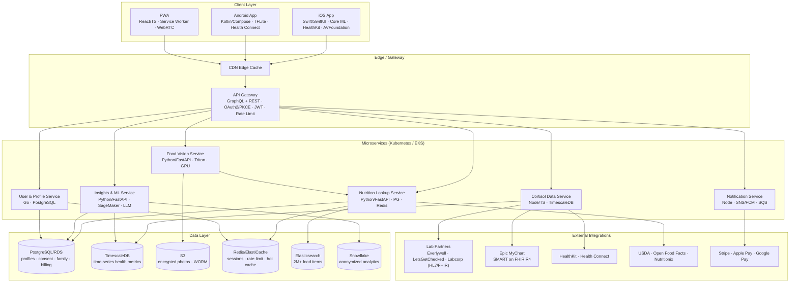
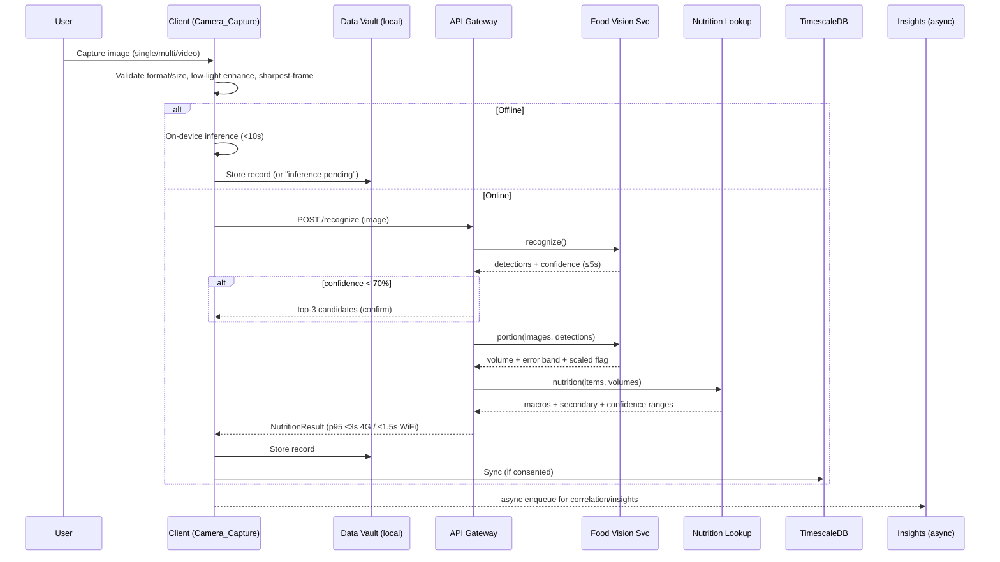
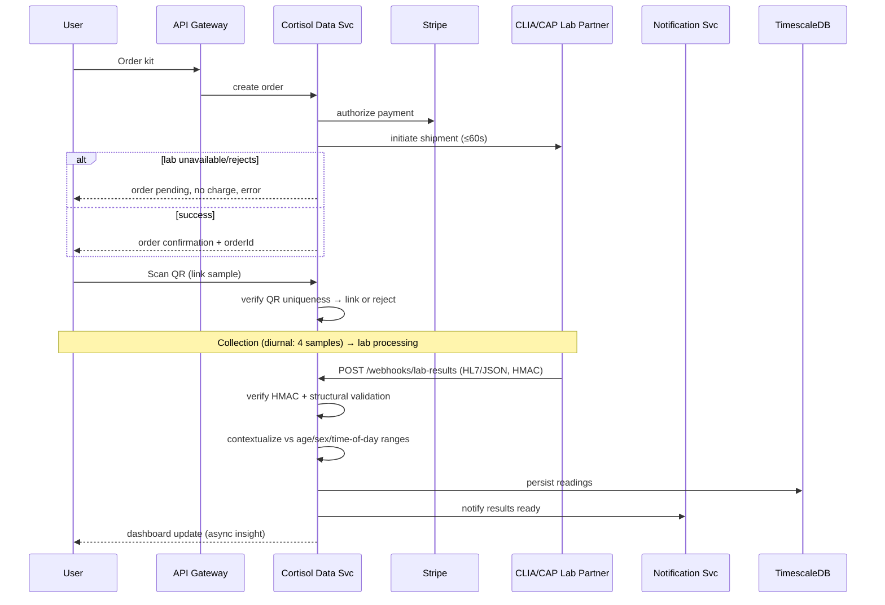
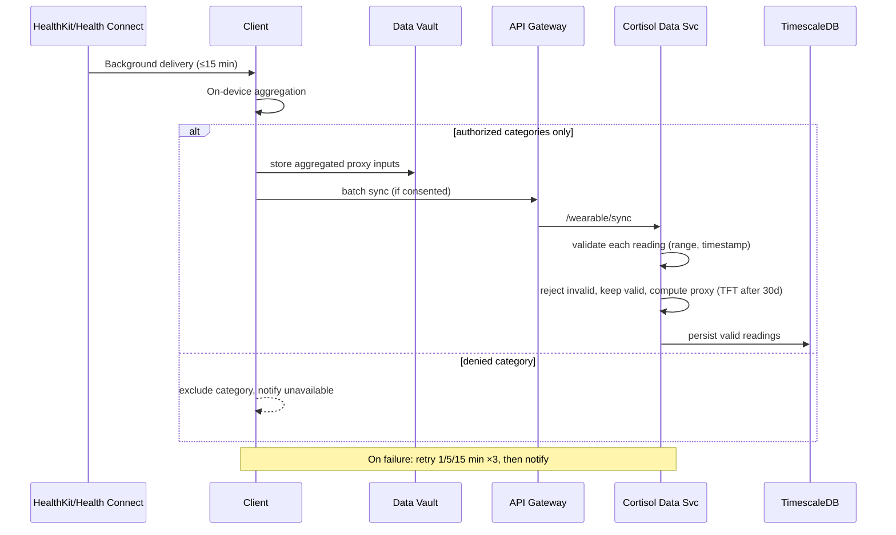

# Design Document: Calorie & Cortisol Tool

## Overview

The Calorie & Cortisol Tool is a dual-function personal health companion delivered as a cloud-native, mobile-first application. It fuses two data streams — nutritional data estimated from food imagery and stress-hormone (cortisol) burden derived from lab kits, wearables, and validated questionnaires — into a Correlation & Insights Engine that surfaces evidence-based, general-wellness guidance.

This design translates the 30 EARS requirements into a concrete technical architecture spanning three native/PWA clients, an API gateway, six containerized microservices, an AI/ML inference layer, and a multi-store data layer. The system is **local-first**: health data lives in an on-device encrypted Data Vault by default and is synchronized to the cloud only for data categories the user has explicitly opted into (Req 17, 25, 30).

### Design Principles

1. **Local-first, opt-in cloud** — nothing leaves the device without recorded per-category consent (Req 17).
2. **General-wellness, non-diagnostic (non-SaMD)** — every insight is template-constrained, clinically approved, and carries a wellness disclaimer; clinical thresholds trigger referrals, never diagnoses (Req 29, 13).
3. **Graceful degradation** — offline inference, retry-with-backoff, and "results-pending"/"unscaled"/"unavailable" states are first-class outcomes, never hard failures (Req 2, 8, 9, 27).
4. **Separation of concerns** — capture, recognition, portion estimation, nutrition lookup, cortisol ingestion, correlation, and account management are independently deployable services.
5. **Compliance by construction** — encryption with per-user keys, audit logging, EU data residency, CLIA/BAA gating, and consent gates are enforced at the boundary, not bolted on (Req 25, 30).

### Scope of v1.0

- General-wellness framing only. No diagnostic claims, medical condition names, or treatment recommendations (Req 29.1).
- Cortisol trend prediction (Temporal Fusion Transformer) activates only after 30 days of data.
- Correlation significance requires ≥20 aligned pairs in a rolling 30-day window (Req 15).

## Architecture

### System Context



### Request/Data-Flow Style

- **GraphQL** is the primary client API (aggregated reads for dashboards, mutations for corrections/consent).
- **REST webhooks** handle lab result ingestion (HL7/JSON/FHIR) and third-party callbacks.
- **Event-driven** async work (insights recompute, notifications, personalization training) flows over SQS between services; the API returns fast and defers heavy work.

### Cross-Cutting Concerns

| Concern | Mechanism | Requirements |
|---|---|---|
| AuthN | OAuth 2.0 + PKCE, biometric-gated tokens, JWT 15-min + refresh | 18, 25 |
| AuthZ | Per-user + family-role checks at gateway and service | 19, 25 |
| Rate limiting | Per-user/per-IP token bucket in Redis; capacity shedding | 23 |
| Encryption | AES-256 at rest (per-user keys, stored separately), TLS 1.3 + cert pinning | 25 |
| Audit | Append-only audit log, 6-year retention | 25.6 |
| Consent gate | Category-level opt-in checked before any egress | 17, 30 |
| Residency | EU-resident data pinned to EU regions | 30.6, 30.7 |
| Observability | Health checks (60s), autoscale (KEDA/HPA), availability accounting | 23, 24 |

## Components and Interfaces

### Client Layer

All three clients share the local-first architecture: an on-device **Data Vault** (encrypted SQLite/Core Data / Room / IndexedDB), an on-device inference runtime, and a sync engine that respects per-category consent.

#### iOS App (Swift / SwiftUI)
- **Camera_Capture**: AVFoundation for single/multi-angle/video capture; ambient light metering (<50 lux → enhancement); sharpest-frame extraction from video (Req 1).
- **On-device inference**: Core ML with INT8-quantized model (<80 MB) for offline recognition (Req 27, 28).
- **HealthKit bridge**: background delivery every ≤15 min; category-scoped authorization (Req 9).
- **Biometric gate**: Face ID / Touch ID via LocalAuthentication; 60s-background re-prompt (Req 18).

#### Android App (Kotlin / Jetpack Compose)
- Equivalent Camera_Capture, TensorFlow Lite inference, **Health Connect** bridge, Android Biometric prompt.

#### PWA (React / TypeScript)
- WebRTC camera capture; Service Worker for offline capture + queued sync; IndexedDB Data Vault; WASM/TF.js fallback inference.

#### Shared Client Responsibilities

| Responsibility | Interface | Requirements |
|---|---|---|
| Capture & validate media | `capture(mode, mediaConstraints) → CaptureResult` | 1 |
| Offline inference | `inferLocal(image) → DetectionResult \| PendingStatus` | 27 |
| Local Data Vault CRUD | `vault.put/get/list/delete(record)` | 17, 27 |
| Consent-aware sync | `syncEngine.push(records, consentState)` | 17, 27 |
| Correction UI | `applyCorrection(mealId, op) → MealTotals` | 5 |
| Accessibility | WCAG 2.1 AA semantics, screen-reader announcements | 26 |

### API Gateway

- **GraphQL schema** exposing `Meal`, `NutritionResult`, `CortisolReading`, `DiurnalProfile`, `Insight`, `Profile`, `FamilyMember`, `ConsentState`.
- **REST endpoints**: `/webhooks/lab-results` (HMAC-verified), `/webhooks/fhir`, `/integrations/*`.
- Middleware chain: cert-pinning/TLS termination → auth (JWT verify) → rate limiter → consent/residency guard → request validation → route.

### Microservices

#### Food Vision Service (Python / FastAPI + Triton)
- `POST /recognize` — image(s) → detection JSON `{items:[{label, confidence, bbox, mask}], count}` within 5s (Req 2).
- `POST /portion` — image(s) + detections → `{volume_ml, error_band, scaled:boolean, reference_object}` (Req 3).
- Confidence gating: <70% → top-3 candidate list; no item ≥70% → "no food recognized" (Req 2.3, 2.7).
- GPU autoscale via KEDA on queue depth (Req 23).

#### Nutrition Lookup Service (Python / FastAPI + PostgreSQL + Redis + Elasticsearch)
- `POST /nutrition` — items + volumes → macros, secondary nutrients, micronutrients, per-value confidence ranges (Req 4).
- `GET /search?q=` — fuzzy food search over 2M+ items (Elasticsearch) within 5s (Req 7.7).
- `GET /barcode/{code}` — barcode → nutrition (Open Food Facts/USDA/Nutritionix) within 5s (Req 7.1).
- Redis caches top 50K items; density lookup table for volume→mass.

#### Cortisol Data Service (Node.js / TypeScript + TimescaleDB)
- `POST /webhooks/lab-results` — HL7/JSON ingestion, HMAC-verified, structural validation (Req 8.4, 8.8).
- `POST /kits/order`, `POST /kits/link` — CLIA/CAP order + QR linkage (Req 8.1, 8.2).
- `POST /wearable/sync` — batched wearable/patch import with per-reading validation (Req 9).
- `POST /questionnaire` — PSS-10/GAD-7/PSQI scoring → burden tier (Req 10).
- `POST /car` — CAR sample window validation + pattern classification (Req 11).
- `GET /trend?range=` — trend series + reference bands + overlays (Req 12).
- `POST /lab-import` (PDF OCR) and `GET /fhir/import` (Epic MyChart) (Req 14).
- TimescaleDB hypertables partitioned by time; read replicas for trend queries.

#### Insights & ML Service (Python / FastAPI + SageMaker + LLM)
- `POST /correlate` — align food/cortisol within ±180 min, significance test (Req 15).
- `POST /guidance` — classification → clinically approved recommendation cards (Req 13).
- `GET /digest` — weekly digest generation, Sunday 08:00 local (Req 15.6).
- Template-constrained LLM (GPT-4o/Gemini 1.5 Pro) grounded on user data only, with mandatory disclaimer injection and approval-status filter (Req 29).
- TFT/LSTM-Attention trend prediction activates after 30 days of data.

#### User & Profile Service (Go / PostgreSQL)
- `POST /onboarding/step`, `GET /onboarding/resume` — 5-step adaptive flow (Req 16).
- `PUT /consent` — per-category opt-in state (Req 17, 30).
- `POST /family/members` — up to 5 isolated profiles with role enforcement (Req 19).
- `POST /export`, `POST /account/delete` — GDPR Art. 20/17 (Req 20).
- `POST /auth/biometric` — biometric token exchange, fallback flow (Req 18).

#### Notification Service (Node.js + SNS/FCM + SQS)
- Event-driven push/email/alerts: deviation alerts, sync-failure notices, digest delivery, referral prompts. Consumes SQS events from other services.

### Component-to-Requirement Traceability (summary)

| Requirement Area | Primary Component(s) |
|---|---|
| 1 Photo capture | Camera_Capture (clients) |
| 2 Recognition | Food Vision Service |
| 3 Portion | Food Vision Service (Portion_Estimator) |
| 4 Nutrition | Nutrition Lookup Service |
| 5 Correction | Correction_UI + Nutrition Lookup + Personalization queue |
| 6 History/Dashboard | Food module (client aggregation + Nutrition) |
| 7 Supplementary input | Nutrition Lookup (barcode/search/OCR) + client voice |
| 8 Lab kit | Cortisol Data Service (Lab_Integration) |
| 9 Wearables | Cortisol Data Service (Wearable_Integration) |
| 10 Questionnaire | Cortisol Data Service (Questionnaire_Engine) |
| 11 Diurnal | Cortisol Data Service (Diurnal_Tracker) |
| 12 Trend viz | Cortisol Data Service + client charting |
| 13 Guidance | Insights & ML Service (Guidance_Engine) |
| 14 Lab import/sharing | Cortisol Data Service |
| 15 Correlation | Insights & ML Service (Correlation_Engine) |
| 16 Onboarding | User & Profile Service (Account_Module) |
| 17 Privacy/consent | User & Profile + client sync engine |
| 18 Biometric | Client + User & Profile Service |
| 19 Family | User & Profile Service |
| 20 Export/deletion | User & Profile Service |
| 21 Performance | All (SLO budgets) |
| 22 Accuracy | Food Vision + evaluation harness |
| 23 Scalability | Gateway + KEDA/HPA autoscale |
| 24 Availability | Health-check/monitoring subsystem |
| 25 Security | Cross-cutting (gateway + all) |
| 26 Accessibility | Clients |
| 27 Offline | Clients (Data Vault + sync) |
| 28 Resource efficiency | Clients (model packaging) |
| 29 Wellness framing | Insights & ML Service + clients |
| 30 Compliance controls | Cortisol Data + User & Profile + gateway |

## Key Data Flows

### Flow 1: Food Photo → Calorie Estimate (Req 1, 2, 3, 4, 21, 27)



Timeout guard: if analysis exceeds 10s, cancel, retain input, offer retry (Req 21.6).

### Flow 2: Lab Kit → Cortisol Result (Req 8, 14, 24, 30)



### Flow 3: Wearable → Cortisol Proxy (Req 9, 10, 12)



## Data Models

### Core Domain Types (language-neutral)

```typescript
// ---------- Food domain ----------
type FoodItem = {
  id: string;
  label: string;              // one of ≥2000 categories
  confidence: number;         // 0..100 (Req 2.2)
  bbox?: BoundingBox;
};

type PortionEstimate = {
  volumeMl: number;           // ≥ 0
  errorPct: number;           // ±15% single / ±8% multi (Req 3.1/3.2)
  scaled: boolean;            // false → accuracy reduced (Req 3.4)
  referenceObject?: "plate" | "hand" | "utensil";
};

type NutrientValue = {
  value: number;              // ≥ 0
  unit: "kcal" | "g" | "mg";
  lower: number;              // lower ≤ value ≤ upper (Req 4.5)
  upper: number;
  available: boolean;         // false → "unavailable" (Req 4.6)
};

type Meal = {
  id: string;
  userId: string;
  loggedAt: string;           // ISO timestamp (local + offset)
  items: MealItem[];          // 0..20
  totals: NutritionTotals;    // recomputed on every correction (Req 5)
  source: "photo" | "barcode" | "voice" | "menuOCR" | "textSearch" | "manual";
  syncStatus: "local" | "pending" | "synced" | "conflict";
};

type MealItem = {
  foodItem: FoodItem;
  portionMultiplier: number;  // 0.25..3.0 step 0.25 (Req 5.1)
  nutrition: Record<string, NutrientValue>;
};

type NutritionTotals = {
  calories: NutrientValue;    // primary macros (Req 4.1)
  protein: NutrientValue;
  carbs: NutrientValue;
  fat: NutrientValue;
  secondary: Record<string, NutrientValue>; // fiber,sugar,sodium,satFat,cholesterol (Req 4.2)
  micronutrients?: Record<string, NutrientValue>; // Req 4.3/4.4
};

type PlateCalibration = { userId: string; referenceScale: number; updatedAt: string };
type Correction = { mealId: string; op: CorrectionOp; trainingQueued: boolean }; // Req 5.5/5.8

// ---------- Cortisol domain ----------
type CortisolReading = {
  id: string;
  userId: string;
  measuredAt: string;         // ISO timestamp
  valueNmolL: number;         // normalized unit
  source: "lab" | "patch" | "wearableProxy" | "questionnaireProxy";
  sourceId?: string;          // patch/device id (Req 9.3/9.5)
  timeOfDayBucket: "morning" | "noon" | "afternoon" | "evening";
  contextualized?: ReferenceContext; // vs age/sex/time (Req 8.5)
  valid: boolean;             // Req 9.4
};

type ReferenceContext = {
  ageBand: string; sex: "M" | "F" | "other";
  refLower: number; refUpper: number;
  classification: "below" | "normal" | "above";
};

type QuestionnaireResult = {
  type: "PSS-10" | "GAD-7" | "PSQI";
  answers: number[];          // all items required (Req 10.2)
  totalScore: number;         // within valid range (Req 10.1)
  tier: "Low" | "Moderate" | "Elevated" | "High"; // deterministic map (Req 10.3)
};

type CARMeasurement = {
  userId: string;
  wakeTime: string;
  sample1?: { at: string; value: number };  // ≤35 min after wake
  sample2?: { at: string; value: number };  // 25..35 min after sample1
  increasePct?: number;       // <50% → flattened (Req 11.5)
  status: "incomplete" | "complete" | "flattened";
};

type LifeEvent = { userId: string; date: string; label: string }; // Req 12.3/12.4

// ---------- Correlation / Insights ----------
type AlignedPair = {          // within ±180 min (Req 15.1)
  mealId: string; readingId: string; deltaMinutes: number;
};

type CorrelationResult = {
  coefficient: number;        // |r| ≥ 0.5 significant (Req 15.3)
  pValue: number;             // < 0.05 significant
  pairCount: number;          // ≥ 20 to analyze (Req 15.4)
  significant: boolean;
};

type Insight = {
  id: string;
  templateId: string;
  approvalStatus: "approved" | "draft" | "pending" | "revoked"; // only approved shown (Req 13.3/29.3)
  disclaimerRendered: boolean; // Req 29.2/29.5
  rankScore: number;          // descending correlation strength (Req 15.8)
};

// ---------- Account / Compliance ----------
type ConsentState = {
  userId: string;
  categories: Record<string, boolean>; // per-category opt-in (Req 17)
  healthDataConsent: boolean;          // Req 30.4
  updatedAt: string;
};

type FamilyAccount = {
  id: string;
  adminUserId: string;
  members: MemberProfile[];   // ≤ 5 (Req 19.1)
};
type MemberProfile = { id: string; role: "admin" | "member"; };

type AuditEntry = {           // Req 25.6
  actorId: string; action: "read"|"create"|"modify"|"delete";
  recordId: string; timestamp: string; // retained ≥ 6 years
};

type Residency = { userId: string; region: string; euResident: boolean }; // Req 30.6/30.7
```

### Data Store Mapping

| Store | Holds |
|---|---|
| On-device Data Vault | All health data by default; offline records; sync queue (Req 17, 27) |
| PostgreSQL (RDS) | Profiles, consent, family, billing, calibration, audit metadata |
| TimescaleDB | Cortisol readings, wearable proxy series, diurnal samples (hypertables) |
| S3 (encrypted, WORM) | Food photos, per-user prefixes |
| Redis (ElastiCache) | Sessions, rate-limit counters, top-50K nutrition cache |
| Elasticsearch | 2M+ food item fuzzy search index |
| Snowflake | Anonymized analytics + training data |

## AI/ML Model Design

### Food Recognition
- **Architecture**: ViT-L/14 or EfficientNetV2-XL. Cloud runs full-precision on Triton (GPU A100/H100); on-device runs an **INT8-quantized (<80 MB)** Core ML / TFLite variant (Req 28.2).
- **Output**: multi-instance detection (≤20 items) with per-item confidence 0–100; restaurant path uses menu OCR + POS with fallback to standard classification (Req 2).
- **Coverage**: ≥2,000 food categories (Req 2.1).

### Volume / Portion Estimation
- **Depth**: DPT monocular depth (MiDaS fallback) for single-angle (±15%); **multi-angle photogrammetry** for 3-shot (±8%) (Req 3.1/3.2).
- **Reference detection**: YOLOv9 detects plate/hand/utensil for scaling; missing → unscaled flag (Req 3.3/3.4).
- **Volume→mass**: density lookup table per food class; personal plate calibration overrides reference scale (Req 3.6).

### Cortisol Trend Prediction
- **Model**: Temporal Fusion Transformer (LSTM-Attention fallback); **activates only after 30 days** of data; bias monitoring on demographic slices.

### LLM Insight Layer
- **Template-constrained** generation grounded strictly on the user's own data; safety guardrails; **mandatory wellness disclaimer** injected; only clinical-advisory-board-**approved** templates are eligible (Req 13, 29). Draft/pending/revoked templates are filtered out before generation.

### ML Ops
- NVIDIA Triton (primary) + SageMaker MME (fallback); MLflow model registry; LaunchDarkly feature flags for model rollout; SageMaker training on spot instances; Airflow data pipeline feeding Snowflake.

### Accuracy Evaluation Harness (Req 22)
- Offline batch evaluates against a dietitian-verified dataset (≥500 items), computing MAPE per capture mode, recording MAPE + mode + item count, and flagging runs at/above threshold (15% single / 5% multi) as failed while retaining results.

## Correctness Properties

*A property is a characteristic or behavior that should hold true across all valid executions of a system — essentially, a formal statement about what the system should do. Properties serve as the bridge between human-readable specifications and machine-verifiable correctness guarantees.*

The following properties were derived from the acceptance-criteria prework and consolidated to remove redundancy. Each is universally quantified and intended for property-based testing (minimum 100 generated iterations).

### Food Capture & Recognition

### Property 1: Failed recognition retains the captured input
*For any* capture, if recognition fails or times out, the captured image is retained and available for retry without recapture, and no partial result is stored.

**Validates: Requirements 1.2, 21.6**

### Property 2: Partial multi-angle capture is never submitted
*For any* multi-angle session exited before all 3 shots are captured (0, 1, or 2 shots), the partial image set is discarded and nothing is submitted for volume reconstruction.

**Validates: Requirements 1.5**

### Property 3: Media acceptance matches the format/size rule
*For any* gallery file, the file is accepted for recognition if and only if it is a supported format AND is 20 MB or smaller; rejected files are never submitted.

**Validates: Requirements 1.6, 1.7**

### Property 4: Video frame selection picks maximum sharpness
*For any* video of 60 seconds or less, the frame submitted for recognition has the maximum sharpness score among all sampled frames.

**Validates: Requirements 1.8**

### Property 5: Low-light enhancement threshold
*For any* ambient light reading, on-device enhancement is applied before submission if and only if the reading is below 50 lux.

**Validates: Requirements 1.9**

### Property 6: Detection output bounds
*For any* recognition result, the number of detected items is at most 20 and every per-item confidence score lies within the inclusive range 0 to 100.

**Validates: Requirements 2.2**

### Property 7: Confidence-threshold branching
*For any* detection, an item with confidence below 70% yields a top-3 candidate confirmation prompt rather than automatic classification; and if no item reaches 70%, the result is "no food recognized" with the image retained for the session.

**Validates: Requirements 2.3, 2.7**

### Portion & Nutrition

### Property 8: Scaling reflects reference-object presence
*For any* processable image, the returned volume estimate is flagged scaled if and only if a reference object (plate, hand, or utensil) is detected, and the estimate is never discarded when unscaled.

**Validates: Requirements 3.3, 3.4**

### Property 9: Unprocessable images are rejected atomically
*For any* image with no detectable food region or resolution below 640×480, the portion submission is rejected with a reason and no partial estimate is retained.

**Validates: Requirements 3.5**

### Property 10: Plate calibration persistence and application
*For any* user who successfully calibrates a plate, all subsequent estimations use the stored calibration as the reference scale until it is changed or removed; and if persistence fails, the previously stored calibration (or none) remains in effect.

**Validates: Requirements 3.6, 3.7**

### Property 11: Nutrient confidence ranges bracket the value
*For any* displayed nutrient value, its confidence range satisfies lower ≤ value ≤ upper in the same unit.

**Validates: Requirements 4.5**

### Property 12: Partial nutrition availability
*For any* meal where one or more nutrients cannot be calculated, each uncalculable nutrient is flagged unavailable and every remaining calculable nutrient value is still displayed.

**Validates: Requirements 4.1, 4.2, 4.6**

### Meal Correction, History & Aggregation

### Property 13: Meal totals always equal the sum of current items
*For any* meal and any sequence of correction operations (add, swap, delete, portion-multiplier change within 0.25×–3×), the meal totals equal the sum of the current items' nutrition; a meal with no items has zero totals.

**Validates: Requirements 5.1, 5.2, 5.3, 5.4, 5.7**

### Property 14: Failed corrections leave the meal unchanged
*For any* correction whose lookup (text/barcode) returns no match, the meal and its totals remain unchanged and a no-match indication is returned.

**Validates: Requirements 5.6, 7.2, 7.6, 7.8**

### Property 15: Every correction produces a durable training record
*For any* applied correction, a training record is enqueued for the Personalization_Model; if enqueuing fails, the correction remains applied in the food log and is queued for retry.

**Validates: Requirements 5.5, 5.8**

### Property 16: Range aggregation equals the sum over the range
*For any* set of logged meals and any date range (including a single day and days with no meals counted as zero), the aggregated calorie and macronutrient totals equal the sum of the per-meal values across meals whose log date falls within the range.

**Validates: Requirements 6.1, 6.2, 6.3**

### Property 17: Logging streak definition
*For any* logging history, the consecutive-day streak equals the number of unbroken calendar days ending on the current day on which at least one meal was logged, resets to zero on any gap day, and is always a whole number in [0, 3650].

**Validates: Requirements 6.4, 6.5**

### Property 18: Insights gating on distinct logged days
*For any* logging history, meal-pattern insights are shown if and only if at least 7 distinct calendar days with a logged meal exist in the preceding 30 days; otherwise the insufficient-history message states exactly (7 − distinctDays) additional days required.

**Validates: Requirements 6.6, 6.7**

### Cortisol Ingestion & Validation

### Property 19: QR linkage never overwrites an existing association
*For any* QR scan, a valid unused code links the sample to the scanning user's account; an invalid, unrecognized, or already-linked code is rejected and leaves any existing account-to-sample association unchanged.

**Validates: Requirements 8.2, 8.7**

### Property 20: Diurnal sample window acceptance
*For any* diurnal sample, it is accepted only if it falls within its defined window (morning CAR within 30 min of waking; noon 11:00–13:00; afternoon 15:00–17:00; evening 22:00–00:00 local).

**Validates: Requirements 8.3**

### Property 21: Reference-range contextualization
*For any* ingested reading with user age and sex available, the reading is classified below/normal/above using the reference range appropriate to the user's age, sex, and time-of-day bucket.

**Validates: Requirements 8.5**

### Property 22: Lab failure preserves order without charge
*For any* order where the lab is unavailable, rejects the order, or results are missing/invalid within 72 hours, the order is retained (pending or results-pending), no charge is applied on rejection, and an appropriate error is surfaced.

**Validates: Requirements 8.6, 8.8**

### Property 23: Imported readings are tagged with source and timestamp
*For any* imported wearable/patch/device reading that is accepted, it carries a source identifier (patch id or device type) and a measurement/capture timestamp.

**Validates: Requirements 9.3, 9.5**

### Property 24: Reading validation isolates invalid measurements
*For any* import batch, a measurement is rejected and recorded as invalid (and excluded from proxy calculations) if and only if its value falls outside 0.01–100.00 in the reported unit or it lacks a timestamp; valid measurements in the same batch are retained.

**Validates: Requirements 9.4**

### Property 25: Authorization scoping on import
*For any* platform import, only categories the user has explicitly authorized are imported; unauthorized categories are excluded and previously imported data is retained.

**Validates: Requirements 9.2, 9.8**

### Questionnaire, Diurnal & Trend Logic

### Property 26: Questionnaire scoring is bounded and complete-input gated
*For any* fully answered questionnaire, the total score lies within its defined valid range (PSS-10 0–40, GAD-7 0–21, PSQI 0–21); any submission with one or more unanswered items is rejected with entered answers retained.

**Validates: Requirements 10.1, 10.2**

### Property 27: Tier mapping is total and deterministic
*For any* valid questionnaire score, the mapping to a cortisol burden tier (Low, Moderate, Elevated, High) yields exactly one tier and always the same tier for the same score, using the fixed threshold bands.

**Validates: Requirements 10.3**

### Property 28: Non-clinical framing precedes the tier value
*For any* presented cortisol burden tier, the non-clinical wellness framing text appears adjacent to and before the tier value.

**Validates: Requirements 10.4**

### Property 29: CAR sample window validation and completeness
*For any* CAR measurement, sample 1 is accepted only within 30 min (±5) of wake time and sample 2 only 25–35 min after sample 1; out-of-window samples are rejected while previously accepted samples are retained; with fewer than two valid samples, pattern evaluation is withheld.

**Validates: Requirements 11.1, 11.2, 11.3**

### Property 30: Diurnal deviation classification
*For any* complete CAR measurement, the pattern is classified as flattened (with alert) if and only if the increase from waking to +30-minute sample is below 50%; and an elevated-evening alert is raised if and only if the evening sample exceeds the age-matched reference upper bound.

**Validates: Requirements 11.5, 11.6**

### Property 31: Trend range filtering
*For any* selected 7/30/90-day range, the rendered trend contains exactly the cortisol readings whose timestamps fall within the range, plus reference bands.

**Validates: Requirements 12.1**

### Property 32: Life-event annotation matches range membership
*For any* recorded life event, its annotation appears on the chart if and only if the event date falls within the selected range; out-of-range events are omitted without error.

**Validates: Requirements 12.3, 12.4**

### Correlation & Insights

### Property 33: Alignment window correctness
*For any* set of food entries and cortisol readings, the aligned pair set is exactly those pairs whose timestamps differ by at most 180 minutes; entries with no partner in the window are excluded without error.

**Validates: Requirements 15.1, 15.2**

### Property 34: Significance gating and classification
*For any* rolling 30-day window, a relationship is classified significant (with a smart alert) if and only if there are at least 20 aligned pairs AND |correlation| ≥ 0.5 AND p-value < 0.05; otherwise significance analysis is withheld with a "more data required" indication.

**Validates: Requirements 15.3, 15.4**

### Property 35: Recurring-pattern surfacing threshold
*For any* 30-day window, a same-direction significant relationship is surfaced as recurring if and only if it is detected on at least 3 separate days.

**Validates: Requirements 15.5**

### Property 36: Insight ranking is sorted by descending correlation strength
*For any* set of surfaced insights at a usage milestone, the output ordering is non-increasing in correlation strength.

**Validates: Requirements 15.8**

### Property 37: Guidance card count and readiness gate
*For any* classification with at least 7 days of readings, the guidance engine presents between 1 and 5 recommendation cards; with fewer than 7 days it withholds cards, shows a "more readings required" message, and retains the collected readings.

**Validates: Requirements 13.1, 13.4**

### Property 38: Referral card precedence
*For any* history where cortisol stays above the referral threshold for 3 or more consecutive weeks, a professional-referral card is present and ordered above all other cards.

**Validates: Requirements 13.2**

### Property 39: Only clinically approved content is ever displayed
*For any* candidate insight/recommendation content, it is displayed only if its clinical-advisory-board approval status is "approved"; draft, pending, and revoked content is always excluded, and when nothing matches, a "no guidance available" message is shown with reading data retained.

**Validates: Requirements 13.3, 13.5, 29.3, 29.4**

### Property 40: Displayed insights always carry a rendered disclaimer
*For any* displayed health insight, a wellness disclaimer is rendered within the same view; if the disclaimer cannot be rendered, the insight is withheld and an unavailable indication is shown.

**Validates: Requirements 29.2, 29.5**

### Property 41: Insight content excludes diagnostic language
*For any* generated insight in v1.0, the content contains no diagnostic claim, medical condition name, or treatment recommendation from the disallowed-term set.

**Validates: Requirements 29.1**

### Account, Consent & Compliance

### Property 42: Onboarding step validation gate
*For any* onboarding step submission, advancement to the next step occurs if and only if all required fields for that step are provided and wake time is a valid time in 00:00–23:59; blocked advances retain entered responses and identify the invalid field.

**Validates: Requirements 16.4, 16.5**

### Property 43: Onboarding preserves and resumes state
*For any* onboarding session, navigating back preserves already-entered responses, and exiting before completion resumes at the first incomplete step with prior responses intact; a post-step-5 profile-creation failure retains all responses for retry.

**Validates: Requirements 16.2, 16.7, 16.8**

### Property 44: Master consent gate on egress and persistence
*For any* health-data category, the data is transmitted off-device or persisted to the cloud only if an explicit opt-in consent for that category is recorded; disabling a consent stops further egress for that category and retains the local copy, and attempts without consent are blocked with a consent-required indication.

**Validates: Requirements 17.1, 17.2, 17.3, 17.4, 17.6, 30.4, 30.5**

### Property 45: Biometric access gate and fallback
*For any* app open/resume after ≥60 s in background with biometrics enabled, health data stays hidden until a successful match; a single failure keeps data hidden and allows retry, 3 consecutive failures deny biometrics and present the fallback method, and canceling presents the fallback.

**Validates: Requirements 18.1, 18.3, 18.4, 18.6**

### Property 46: Family capacity and isolation
*For any* family account, the member count never exceeds 5 (adds beyond 5 are rejected leaving existing profiles unchanged), and one member's health data is never readable or modifiable from another profile; only an admin may add/edit/remove member profiles.

**Validates: Requirements 19.1, 19.2, 19.3, 19.4, 19.5, 19.6**

### Property 47: Export authorization and completeness
*For any* export request, it succeeds only for an authenticated/verified user and, when it succeeds, contains all of the user's personal data in both JSON and CSV; unauthenticated requests are rejected with no file produced.

**Validates: Requirements 20.1, 20.2**

### Property 48: Atomic failure preserves prior state (import/report/export/deletion)
*For any* import, report-generation, export, or deletion operation that fails, no partial artifact is produced and the user's prior data is preserved unchanged, with an appropriate error/notification surfaced.

**Validates: Requirements 14.2, 14.3, 14.5, 14.7, 20.3, 20.7**

### Property 49: Deletion completeness with legal-retention carve-out
*For any* confirmed account deletion, all personal data is deleted except categories under a legal retention obligation, which are restricted to the retention purpose and reported with their basis.

**Validates: Requirements 20.5, 20.6**

### Property 50: Bounded retry with data retention
*For any* failing synchronization or delivery operation, the affected data/artifact is retained unchanged, retries are bounded by the operation's defined schedule (sync 3× at 1/5/15 min; consent-sync 3×; digest 3× at 30 min), and after the final failed attempt a notification/in-app fallback is presented.

**Validates: Requirements 9.7, 15.7, 17.5, 27.5**

### Property 51: Offline capture storage and pending status
*For any* offline capture, the record is stored in the local Data Vault; if on-device inference does not complete within 10 s the photo is stored with "inference pending" status; and if free storage is below the 50 MB minimum the capture is rejected with existing records retained.

**Validates: Requirements 27.1, 27.2, 27.3**

### Property 52: Reconnect sync completeness and conflict handling
*For any* set of locally stored unsynced records after connectivity is restored, exactly the records permitted by the user's sync settings are synchronized; on a conflict both versions are retained and the settings-defined resolution is applied deterministically.

**Validates: Requirements 27.4, 27.6**

### Property 53: Encryption round-trip with separated keys
*For any* health-data record, decrypting the AES-256-encrypted stored form with the user's key yields the original record, and the key material is stored separately from the ciphertext.

**Validates: Requirements 25.1**

### Property 54: Audit entry on every health-data access
*For any* read, create, modify, or delete of health data — including denied unauthenticated/unauthorized attempts — a complete audit entry (actor identity, action type, record identifier, timestamp) is recorded and retained.

**Validates: Requirements 25.6, 25.7**

### Property 55: TLS/cert-pinning failure blocks all health-data egress
*For any* transmission attempt where TLS 1.3 cannot be established or certificate-pinning validation fails, the connection is rejected, zero health-data bytes are transmitted, and the failed attempt is recorded.

**Validates: Requirements 25.3**

### Property 56: Health-check downtime state machine
*For any* sequence of health-check results, a service is recorded unavailable after exactly 3 consecutive failed checks (recording the downtime start) and available again after exactly 3 consecutive successful checks (recording the downtime end), and recorded downtime intervals are retained.

**Validates: Requirements 24.3, 24.4, 24.5**

### Property 57: CLIA lab-partner gating
*For any* lab partner, result ingestion is enabled if and only if the partner holds a CLIA certification whose expiration date is later than the current date; otherwise ingestion stays disabled and a compliance indicator records the failed verification.

**Validates: Requirements 30.1, 30.2**

### Property 58: BAA gate on PHI exchange
*For any* partner that handles PHI, PHI exchange is permitted only if an executed Business Associate Agreement is on record; otherwise the exchange is blocked and a compliance indicator records the missing agreement.

**Validates: Requirements 30.3**

### Property 59: EU data-residency invariant
*For any* user identified as an EU resident, all stored/retained data resides exclusively in EU regions; if any such data is found outside an EU region, further processing is blocked and a residency-violation compliance indicator is recorded.

**Validates: Requirements 30.6, 30.7**

### Property 60: Calorie estimate non-negativity and accuracy-run classification
*For any* returned single calorie estimate the value is a number ≥ 0 kcal; and for any completed accuracy evaluation run, the run is flagged failed if and only if the measured MAPE is at or above the applicable threshold (15% single-angle, 5% multi-angle), with MAPE, capture mode, and item count recorded.

**Validates: Requirements 22.3, 22.4, 22.5**

### Property 61: Accessibility semantics completeness
*For any* rendered screen, every interactive element and informational image exposes an accessible name, role, and current state; text/background color pairs meet the WCAG AA contrast minimums (4.5:1 normal, 3:1 large) and interactive targets are at least 44×44 CSS px; and voice-guided fields re-prompt at most 3 times before offering an alternative input method.

**Validates: Requirements 26.1, 26.2, 26.5**

## Error Handling

The system treats degraded outcomes as first-class results rather than crashes. Error handling follows four consistent patterns.

### 1. Atomic Failure (no partial artifacts)
Operations that produce a durable artifact (lab-result OCR, FHIR import, PDF report, data export, account deletion, calibration persistence) are all-or-nothing. On failure they produce no partial artifact, leave prior state unchanged, and surface a specific error. (Req 3.7, 14.2, 14.3, 14.5, 14.7, 20.3, 20.7 — Property 48.)

### 2. Retain-and-Retry with bounded backoff
Transient failures (wearable sync, cloud sync, digest delivery) retain the affected data and retry on a bounded schedule, then notify:

| Operation | Retries | Intervals |
|---|---|---|
| Wearable background sync (9.7) | 3 | 1, 5, 15 min |
| Consent-category cloud sync (17.5, 27.5) | 3 | exponential/settings |
| Weekly digest delivery (15.7) | 3 | 30 min |

After the final failed attempt: notification + in-app fallback (Property 50).

### 3. Validation Rejection (input at the boundary)
Invalid inputs are rejected before mutating state, with a specific reason and prior state preserved:

| Input | Rule | Requirement |
|---|---|---|
| Gallery media | supported format ∧ ≤20 MB | 1.7 |
| Portion image | food region present ∧ ≥640×480 | 3.5 |
| Wearable reading | value ∈ [0.01,100] ∧ has timestamp | 9.4 |
| Questionnaire | all items answered | 10.2 |
| CAR sample | within time window | 11.2 |
| Lab PDF | PDF ∧ ≤20 MB | 14.2 |
| Onboarding step | required fields ∧ valid wake time | 16.5 |
| Local storage | ≥50 MB free | 27.3 |

### 4. Timeout & Capacity
- **Recognition/analysis timeout**: cancel at 10 s, retain input, offer retry (Req 21.6).
- **Recognition soft timeout**: 3 s error indication with retained image (Req 1.2).
- **Capacity shedding**: beyond 10M concurrent users or 10k img/s, reject or queue excess with a capacity-exceeded response while preserving accepted in-progress requests (Req 23.3).

### Error Response Contract
All API errors return a structured shape: `{ code, message, retryable: boolean, retainedState: boolean }`. Clients use `retainedState` to decide whether to preserve local input (as in Properties 1, 14, 48).

### Security & Compliance Failure Modes
- TLS/cert-pin failure → connection rejected, zero health-data egress, attempt recorded (Property 55).
- Unauthenticated/unauthorized access → denied + audit entry (Property 54).
- Missing consent / CLIA / BAA / EU-residency violation → operation blocked + compliance indicator recorded (Properties 44, 57, 58, 59).

## Testing Strategy

The feature is a rich mix of pure business logic (scoring, tier mapping, aggregation, alignment, validation, consent gating) and external/infra concerns (GPU inference latency, cloud autoscale, third-party integrations). Property-based testing applies to the former; integration and smoke tests cover the latter.

### Dual Approach

- **Property-based tests** verify the 61 universal properties above across generated inputs. Use a mature PBT library for each service's language:
  - Python services (Food Vision, Nutrition, Insights): **Hypothesis**
  - Node/TypeScript services (Cortisol Data, Notification, API Gateway): **fast-check**
  - Go service (User & Profile): **gopter** or the standard-library `testing/quick`
  - Do **not** hand-roll property generators/shrinkers — rely on the library.
- **Unit tests** cover specific examples, edge cases, and error branches (e.g., empty day → zero totals, delete-last-item, restaurant OCR fallback, "no biometric hardware" fallback).
- **Integration tests** (1–3 representative cases each) cover external behavior: lab webhook HL7/FHIR ingestion, Epic MyChart FHIR R4, HealthKit/Health Connect import, Stripe order, barcode/voice/menu-OCR pipelines.
- **Smoke tests** cover one-time configuration: ≥2000-category model load, TLS 1.3/cert-pinning config, SOC 2 control presence, on-device model ≤80 MB, install size ≤150 MB.
- **Performance/load tests** cover the latency and scalability SLOs (Req 21, 23, 24 uptime): p95 latency budgets under 4G/WiFi, 10M concurrent users, 10k img/s, autoscale within 300 s.
- **Accuracy evaluation harness** runs the MAPE benchmark against the dietitian-verified dataset (Req 22) as a scheduled CI job.
- **Model bias monitoring** runs on the cortisol TFT across demographic slices.

### Property Test Configuration

- Each property test runs a **minimum of 100 generated iterations**.
- Each property test is tagged with a comment referencing its design property in the format:
  **Feature: calorie-cortisol-tool, Property {number}: {property_text}**
- Each of the 61 correctness properties is implemented by a **single** property-based test.
- Generators must cover the edge cases identified in prework (empty meals, whitespace-only search, boundary confidence at exactly 70%, exactly 20 items, readings at 0.01/100.00, wake-time boundaries 00:00/23:59, streak gaps, EU/non-EU residency, expired vs valid CLIA dates).

### Test-to-Property Mapping (representative)

| Area | Properties | Library |
|---|---|---|
| Capture/recognition logic | 1–7 | fast-check (client) / Hypothesis |
| Portion & nutrition | 8–12 | Hypothesis |
| Correction/history | 13–18 | fast-check |
| Cortisol ingestion | 19–25 | fast-check |
| Questionnaire/diurnal/trend | 26–32 | fast-check |
| Correlation/insights | 33–41 | Hypothesis |
| Account/consent/compliance | 42–61 | gopter / fast-check |

### What is intentionally NOT property-tested

Per the classification prework, the following use integration/smoke/perf tests instead of PBT: latency SLOs (21.1–21.5), scalability (23.1–23.4), uptime percentages (24.1–24.2), external ingestion timing (8.1, 8.4, 9.1, 9.6, 14.1, 14.4), model accuracy MAPE targets (3.1, 3.2, 22.1, 22.2 — the *classification* of eval runs is property-tested as Property 60, but the accuracy values themselves are measured), category-count/model-size/install-size configuration (2.1, 28.2, 28.3), and transport/compliance posture configuration (25.2, 25.4, 25.5).

## Requirements Traceability Matrix

| Req | Title | Design Coverage | Properties |
|---|---|---|---|
| 1 | Food Photo Capture | Camera_Capture (clients), Flow 1 | 1–5 |
| 2 | AI Food Recognition | Food Vision Service | 6, 7 (+2.1 smoke) |
| 3 | Portion Estimation | Food Vision Service | 8–10 (+3.1/3.2 eval) |
| 4 | Nutritional Breakdown | Nutrition Lookup Service | 11, 12 |
| 5 | Manual Correction | Correction_UI + Nutrition + training queue | 13–15 |
| 6 | Meal History/Dashboard | Food module aggregation | 16–18 |
| 7 | Supplementary Input | Nutrition Lookup (barcode/search/OCR), voice | 14 |
| 8 | Cortisol Test Kit | Cortisol Data (Lab_Integration), Flow 2 | 19–22 |
| 9 | Wearable Support | Cortisol Data (Wearable_Integration), Flow 3 | 23–25 |
| 10 | Symptom-Proxy | Questionnaire_Engine | 26–28 |
| 11 | Diurnal Tracking | Diurnal_Tracker | 29, 30 |
| 12 | Trend Visualization | Cortisol Data + client charting | 31, 32 |
| 13 | Cortisol Guidance | Insights & ML (Guidance_Engine) | 37–39 |
| 14 | Lab Import/Sharing | Cortisol Data | 48 |
| 15 | Cross-Modal Correlation | Insights & ML (Correlation_Engine) | 33–36, 50 |
| 16 | Onboarding/Profile | User & Profile (Account_Module) | 42, 43 |
| 17 | Privacy/Consent | User & Profile + client sync engine | 44, 50 |
| 18 | Biometric Auth | Client + User & Profile | 45 |
| 19 | Family Accounts | User & Profile | 46 |
| 20 | Export/Deletion | User & Profile | 47–49 |
| 21 | Performance | SLO budgets (perf tests) | 1 (21.6 timeout) |
| 22 | Calorie Accuracy | Food Vision + eval harness | 60 |
| 23 | Scalability | Gateway + KEDA/HPA (load tests) | — |
| 24 | Availability | Health-check monitoring subsystem | 56 |
| 25 | Security | Cross-cutting | 53–55 |
| 26 | Accessibility | Clients | 61 |
| 27 | Offline Mode | Clients (Data Vault + sync) | 51, 52, 50 |
| 28 | Resource Efficiency | Client model packaging (smoke) | — |
| 29 | Wellness Framing | Insights & ML + clients | 39–41 |
| 30 | Compliance Controls | Cortisol Data + User & Profile + gateway | 44, 57–59 |

All 30 requirements are covered by a design component; testable behavior is covered by the 61 correctness properties plus the integration/smoke/perf tests enumerated above. Requirements whose acceptance criteria are purely performance-, infrastructure-, or configuration-oriented (21, 23, 28, and the SLO/config portions of 2, 24, 25) are validated through integration, load, and smoke tests rather than property-based tests, consistent with the prework classification.
