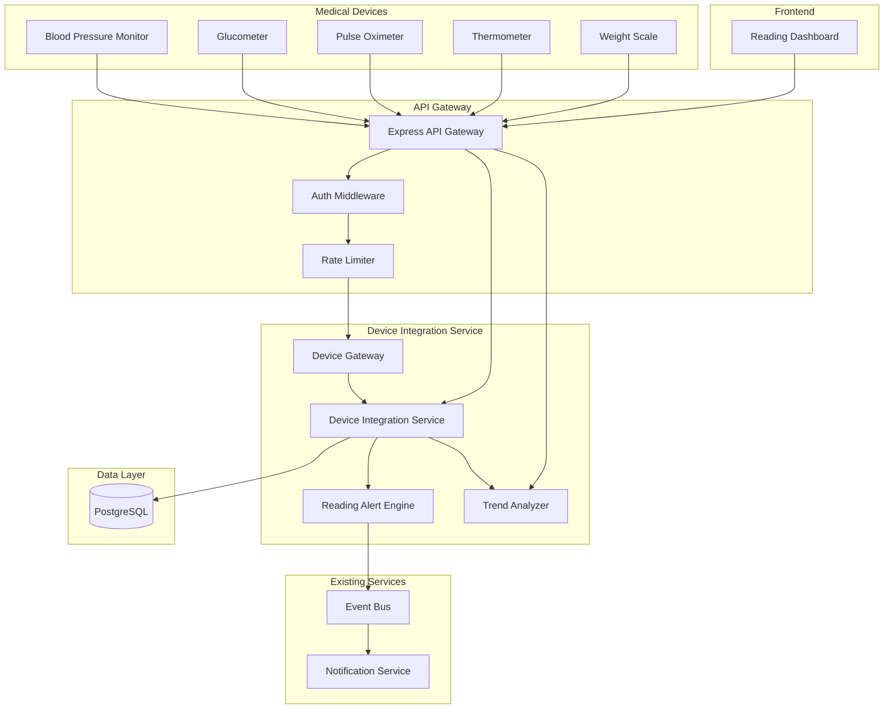
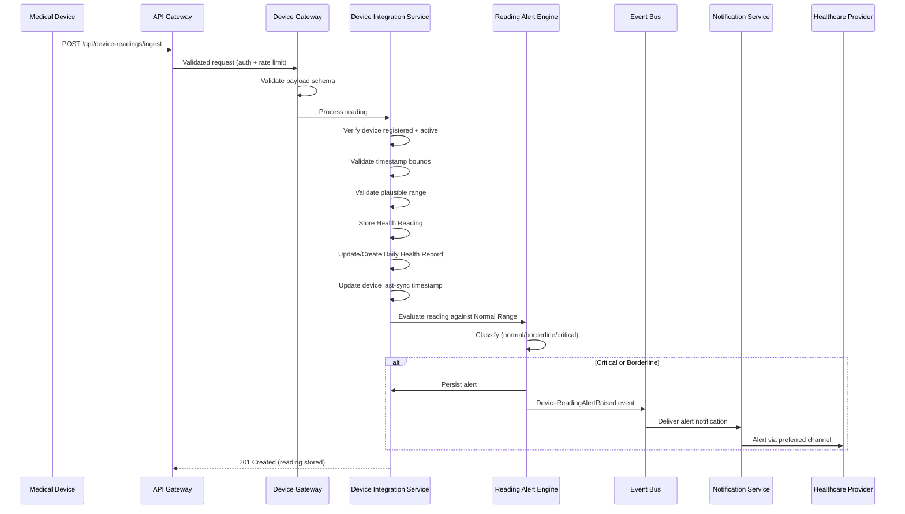
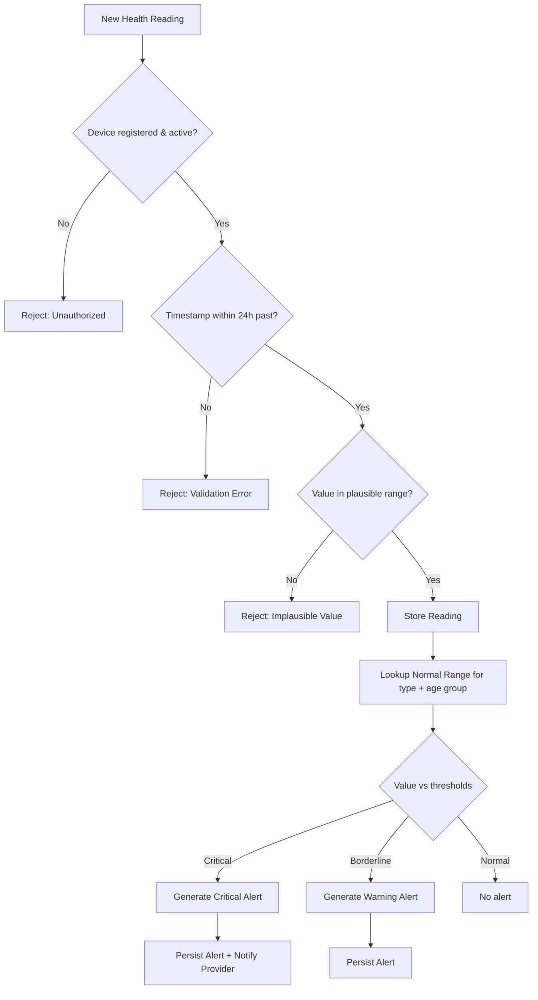
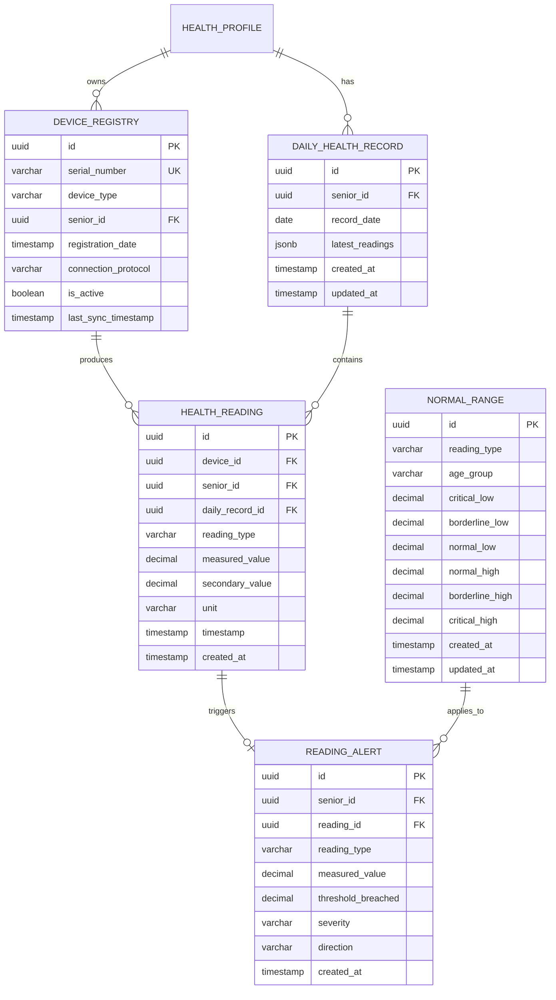

# Design Document: Daily Health Device Readings

## Overview

The Daily Health Device Readings feature extends the Senior Citizen Health Checkup System with continuous health monitoring capabilities between scheduled checkups. It enables automatic collection of vital signs from connected medical devices (blood pressure monitors, glucometers, pulse oximeters, thermometers, and weight scales), stores daily health records per patient, evaluates readings against configurable normal ranges, and presents the data through a professional dashboard with trend visualization and abnormal reading alerts.

### Key Design Decisions

1. **Separate Device Integration Service** — A new bounded context within the existing service layer that owns device registration, reading ingestion, alert evaluation, and trend analysis. This keeps device-related logic isolated from the existing test execution workflow.
2. **Event-driven alert propagation** — The Reading Alert Engine publishes `DeviceReadingAlertRaised` events to the existing event bus, enabling the existing Notification Service to deliver alerts without tight coupling.
3. **Device Gateway as a validation layer** — A dedicated ingestion endpoint that validates device identity, payload schema, timestamp bounds, and plausible ranges before persisting readings. This protects the data layer from malformed device data.
4. **Daily Health Record as an aggregation boundary** — Readings are grouped by Senior ID + calendar date, providing a natural unit for querying and summarization without complex time-windowing logic.
5. **Reuse of existing infrastructure** — Leverages the existing Express API Gateway (auth middleware, rate limiting, error handling), InMemoryEventBus (upgradeable to Redis/BullMQ), Prisma ORM, and Next.js frontend patterns.
6. **Normal Range configuration as a first-class entity** — Threshold definitions are stored in the database (not hardcoded), supporting per-reading-type and per-age-group customization with strict ordering validation.

## Architecture

### High-Level Integration Diagram



### Reading Ingestion Flow



### Alert Evaluation Flow



## Components and Interfaces

### 1. Device Integration Service

**Responsibility:** Core business logic for device registration, reading storage, daily record management, and coordination between the Device Gateway, Alert Engine, and Trend Analyzer.

```typescript
interface DeviceIntegrationService {
  // Device Registration
  registerDevice(request: DeviceRegistrationRequest): Promise<DeviceRegistryEntry>;
  deregisterDevice(deviceId: string): Promise<void>;
  getDevice(deviceId: string): Promise<DeviceRegistryEntry | null>;
  getDevicesBySenior(seniorId: string): Promise<DeviceRegistryEntry[]>;

  // Reading Ingestion
  ingestReading(request: HealthReadingRequest): Promise<HealthReading>;

  // Daily Health Records
  getDailyRecord(seniorId: string, date: string): Promise<DailyHealthRecord | null>;
  getDailyRecords(seniorId: string, startDate: string, endDate: string): Promise<DailyHealthRecord[]>;

  // Alerts
  getAlerts(seniorId: string, filters?: AlertFilters): Promise<ReadingAlert[]>;
}

interface DeviceRegistrationRequest {
  serialNumber: string;
  deviceType: DeviceType;
  seniorId: string;
  connectionProtocol: 'bluetooth' | 'wifi';
}

interface HealthReadingRequest {
  deviceId: string;
  timestamp: string; // ISO 8601
  readingType: ReadingType;
  measuredValue: number;
  secondaryValue?: number; // e.g., diastolic for blood pressure
  unit: ReadingUnit;
}
```

### 2. Device Gateway

**Responsibility:** Ingestion validation layer. Parses incoming device payloads, validates schema conformance, and delegates to the Device Integration Service.

```typescript
interface DeviceGateway {
  validateAndIngest(rawPayload: unknown): Promise<HealthReading>;
}

// Schema validation produces structured errors
interface ValidationError {
  field: string;
  message: string;
  received?: unknown;
}
```

### 3. Reading Alert Engine

**Responsibility:** Evaluates health readings against configured Normal Ranges and generates alerts with appropriate severity levels.

```typescript
interface ReadingAlertEngine {
  evaluateReading(reading: HealthReading, seniorAgeGroup: AgeGroup): AlertResult;
  getApplicableRange(readingType: ReadingType, ageGroup: AgeGroup): NormalRange | null;
}

interface AlertResult {
  triggered: boolean;
  severity?: 'warning' | 'critical';
  thresholdBreached?: number;
  direction?: 'above' | 'below';
}
```

### 4. Trend Analyzer

**Responsibility:** Computes statistical summaries over configurable time periods from historical readings.

```typescript
interface TrendAnalyzer {
  computeTrend(
    seniorId: string,
    readingType: ReadingType,
    period: 'daily' | '7day' | '30day'
  ): Promise<TrendSummary>;

  getTrendDirection(
    seniorId: string,
    readingType: ReadingType
  ): Promise<'improving' | 'stable' | 'declining'>;
}

interface TrendSummary {
  readingType: ReadingType;
  period: 'daily' | '7day' | '30day';
  mean: number;
  min: number;
  max: number;
  count: number;
  startDate: string;
  endDate: string;
}
```

### 5. Normal Range Configuration Service

**Responsibility:** Manages CRUD operations for Normal Range definitions with ordering validation.

```typescript
interface NormalRangeService {
  configure(request: NormalRangeRequest): Promise<NormalRange>;
  update(rangeId: string, request: Partial<NormalRangeRequest>): Promise<NormalRange>;
  getRange(readingType: ReadingType, ageGroup: AgeGroup): Promise<NormalRange | null>;
  getAllRanges(): Promise<NormalRange[]>;
}

interface NormalRangeRequest {
  readingType: ReadingType;
  ageGroup: AgeGroup;
  criticalLow: number;
  borderlineLow: number;
  normalLow: number;
  normalHigh: number;
  borderlineHigh: number;
  criticalHigh: number;
}
```

### 6. Reading Dashboard (Frontend)

**Responsibility:** Displays daily health readings, device sync status, trend charts, and alerts in a responsive, accessible layout.

```typescript
// Frontend page component structure
interface ReadingDashboardProps {
  seniorId: string;
}

// Dashboard sub-components
interface VitalSignCard {
  readingType: ReadingType;
  latestValue: number;
  unit: ReadingUnit;
  timestamp: string;
  trendDirection: 'improving' | 'stable' | 'declining';
  rangeStatus: 'normal' | 'borderline' | 'critical';
}

interface DeviceStatusPanel {
  devices: DeviceStatusEntry[];
}

interface DeviceStatusEntry {
  deviceId: string;
  deviceType: DeviceType;
  serialNumber: string;
  connectionProtocol: 'bluetooth' | 'wifi';
  isActive: boolean;
  lastSyncTimestamp: string | null;
  syncStatus: 'synced' | 'stale' | 'inactive';
}
```

### API Endpoints

All endpoints are prefixed with `/api/device-readings` and require authentication via the existing auth middleware.

| Method | Path | Description | Roles |
|--------|------|-------------|-------|
| POST | `/devices` | Register a new device | Physician, Administrator |
| DELETE | `/devices/:deviceId` | Deregister a device | Physician, Administrator |
| GET | `/devices/senior/:seniorId` | List devices for a senior | Physician, Senior_Citizen, Caregiver, Administrator |
| POST | `/ingest` | Submit a device reading | System (device auth token) |
| GET | `/seniors/:seniorId/daily/:date` | Get daily health record | Physician, Senior_Citizen, Caregiver, Administrator |
| GET | `/seniors/:seniorId/readings` | List readings by date range | Physician, Senior_Citizen, Caregiver, Administrator |
| GET | `/seniors/:seniorId/alerts` | List alerts for a senior | Physician, Senior_Citizen, Caregiver, Administrator |
| GET | `/seniors/:seniorId/trends/:readingType` | Get trend summary | Physician, Senior_Citizen, Caregiver, Administrator |
| GET | `/normal-ranges` | List all normal ranges | Physician, Administrator |
| POST | `/normal-ranges` | Create/update a normal range | Administrator |
| GET | `/health` | Service health check | Public |

**Pagination**: List endpoints support `page` and `pageSize` query parameters (default: 20, max: 100).

**Response Format**: All responses use the existing standardized JSON structure:
```json
{
  "data": { ... },
  "meta": { "page": 1, "pageSize": 20, "total": 42 }
}
```

**Error Format**: Consistent with existing gateway error format:
```json
{
  "error": {
    "code": "VALIDATION_ERROR",
    "message": "Human-readable description",
    "details": [{ "field": "timestamp", "message": "Must be within 24 hours" }]
  }
}
```

## Data Models

### Domain Entities

```typescript
// Device Registry
type DeviceType = 'blood_pressure_monitor' | 'glucometer' | 'pulse_oximeter' | 'thermometer' | 'weight_scale';

interface DeviceRegistryEntry {
  id: string;
  serialNumber: string;
  deviceType: DeviceType;
  seniorId: string;
  registrationDate: Date;
  connectionProtocol: 'bluetooth' | 'wifi';
  isActive: boolean;
  lastSyncTimestamp: Date | null;
}

// Health Reading
type ReadingType = 'blood_pressure' | 'blood_glucose' | 'heart_rate' | 'spo2' | 'temperature' | 'weight';
type ReadingUnit = 'mmHg' | 'mg/dL' | 'bpm' | 'percent' | 'celsius' | 'kg';

interface HealthReading {
  id: string;
  deviceId: string;
  seniorId: string;
  dailyRecordId: string;
  readingType: ReadingType;
  measuredValue: number;
  secondaryValue?: number; // diastolic for blood_pressure
  unit: ReadingUnit;
  timestamp: Date;
  createdAt: Date;
}

// Daily Health Record
interface DailyHealthRecord {
  id: string;
  seniorId: string;
  date: string; // YYYY-MM-DD
  readings: HealthReading[];
  latestReadings: LatestReadingSummary[];
  createdAt: Date;
  updatedAt: Date;
}

interface LatestReadingSummary {
  readingType: ReadingType;
  measuredValue: number;
  secondaryValue?: number;
  unit: ReadingUnit;
  timestamp: Date;
}

// Reading Alert
interface ReadingAlert {
  id: string;
  seniorId: string;
  readingId: string;
  readingType: ReadingType;
  measuredValue: number;
  thresholdBreached: number;
  severity: 'warning' | 'critical';
  direction: 'above' | 'below';
  createdAt: Date;
}

// Normal Range
interface NormalRange {
  id: string;
  readingType: ReadingType;
  ageGroup: AgeGroup;
  criticalLow: number;
  borderlineLow: number;
  normalLow: number;
  normalHigh: number;
  borderlineHigh: number;
  criticalHigh: number;
  createdAt: Date;
  updatedAt: Date;
}

// Plausible Ranges (hardcoded validation boundaries)
const PLAUSIBLE_RANGES: Record<ReadingType, { min: number; max: number }> = {
  blood_pressure: { min: 40, max: 300 },   // systolic mmHg
  blood_glucose: { min: 20, max: 800 },     // mg/dL
  heart_rate: { min: 20, max: 300 },         // bpm
  spo2: { min: 50, max: 100 },              // percent
  temperature: { min: 30, max: 45 },         // celsius
  weight: { min: 20, max: 300 },             // kg
};
```

### Database Schema



### Event Types

```typescript
// New events for the device reading domain
interface DeviceReadingStoredEvent {
  type: 'DeviceReadingStored';
  payload: {
    readingId: string;
    deviceId: string;
    seniorId: string;
    readingType: ReadingType;
    measuredValue: number;
    unit: ReadingUnit;
    timestamp: string;
  };
  occurredAt: string;
}

interface DeviceReadingAlertRaisedEvent {
  type: 'DeviceReadingAlertRaised';
  payload: {
    alertId: string;
    seniorId: string;
    readingId: string;
    readingType: ReadingType;
    measuredValue: number;
    thresholdBreached: number;
    severity: 'warning' | 'critical';
    direction: 'above' | 'below';
    assignedProviderId: string;
  };
  occurredAt: string;
}

interface DeviceSyncStaleEvent {
  type: 'DeviceSyncStale';
  payload: {
    deviceId: string;
    seniorId: string;
    deviceType: DeviceType;
    lastSyncTimestamp: string;
  };
  occurredAt: string;
}
```

## Correctness Properties

*A property is a characteristic or behavior that should hold true across all valid executions of a system — essentially, a formal statement about what the system should do. Properties serve as the bridge between human-readable specifications and machine-verifiable correctness guarantees.*

### Property 1: Device registration produces a complete registry entry

*For any* valid device registration request containing a serial number, device type, Senior ID, and connection protocol, the Device Integration Service SHALL create a Device Registry entry containing all input fields plus a system-generated ID, registration date, active status set to true, and null last-sync timestamp.

**Validates: Requirements 1.1, 1.5**

### Property 2: Device serial number uniqueness across seniors

*For any* device serial number already registered to one Senior, attempting to register the same serial number to a different Senior SHALL be rejected with a conflict error, while re-registering to the same Senior is also rejected (no duplicates).

**Validates: Requirements 1.3**

### Property 3: Deregistered devices reject subsequent readings

*For any* registered device that is subsequently deregistered, the device SHALL be marked inactive and any reading submitted from that device SHALL be rejected with an unauthorized error.

**Validates: Requirements 1.4, 2.3**

### Property 4: Health Reading parse-format round trip

*For any* valid Health Reading object, formatting it to the canonical JSON schema and then parsing that JSON back SHALL produce an object equivalent to the original.

**Validates: Requirements 10.3**

### Property 5: Invalid payload produces field-level validation errors

*For any* reading payload that is missing required fields or contains values of incorrect types, the Device Integration Service SHALL return a 400 response with an array of field-level validation errors identifying each invalid field.

**Validates: Requirements 2.1, 10.1, 10.2**

### Property 6: Valid reading storage with daily record association

*For any* valid reading from a registered active device with a timestamp within the 24-hour window and a plausible value, the reading SHALL be stored and associated with the Daily Health Record for that Senior and calendar date — creating the record if none exists, or appending if one already exists.

**Validates: Requirements 2.2, 3.1, 3.2**

### Property 7: Blood pressure readings store both values

*For any* blood pressure reading containing systolic and diastolic values, the stored Health Reading SHALL contain both the primary (systolic) measuredValue and the secondary (diastolic) secondaryValue as separate fields within a single record.

**Validates: Requirements 2.4**

### Property 8: Timestamp boundary enforcement

*For any* reading with a timestamp more than 24 hours in the past or any time in the future relative to server time, the Device Integration Service SHALL reject the reading with a validation error.

**Validates: Requirements 2.6**

### Property 9: Plausible range enforcement

*For any* reading whose measured value falls outside the physically plausible range for its reading type (e.g., heart rate < 20 or > 300 bpm), the Device Integration Service SHALL reject the reading with a validation error indicating the implausible value.

**Validates: Requirements 10.4**

### Property 10: Daily record query returns all readings grouped by type

*For any* Senior and date with stored readings, requesting the Daily Health Record SHALL return all Health Readings for that Senior on that date, grouped by reading type.

**Validates: Requirements 3.3**

### Property 11: Latest reading summary reflects most recent per type

*For any* Daily Health Record containing multiple readings of the same type, the latest-reading summary for that type SHALL contain the measured value and timestamp of the reading with the most recent timestamp.

**Validates: Requirements 3.4**

### Property 12: Alert classification correctness

*For any* Health Reading value and applicable Normal Range, the Reading Alert Engine SHALL classify the reading as: "critical" if the value is below critical low or above critical high, "warning" if the value is in the borderline zone (between critical and normal thresholds), and generate no alert if the value is within normal range. The persisted alert SHALL contain all required fields (alert ID, Senior ID, reading ID, reading type, measured value, threshold breached, severity, timestamp).

**Validates: Requirements 4.2, 4.3, 4.4**

### Property 13: Normal range ordering validation

*For any* Normal Range configuration submission, the Device Integration Service SHALL accept it if and only if critical_low ≤ borderline_low ≤ normal_low ≤ normal_high ≤ borderline_high ≤ critical_high, and SHALL store all specified fields when accepted.

**Validates: Requirements 5.1, 5.2**

### Property 14: Normal range updates are non-retroactive

*For any* existing Reading Alert generated under a previous Normal Range configuration, updating the Normal Range SHALL NOT modify the existing alert, while new readings SHALL be evaluated against the updated range.

**Validates: Requirements 5.4**

### Property 15: Trend computation mathematical correctness

*For any* non-empty set of Health Readings for a given Senior, reading type, and time period, the Trend Analyzer SHALL compute mean equal to the arithmetic average of all values, min equal to the smallest value, max equal to the largest value, and count equal to the number of readings.

**Validates: Requirements 6.1**

### Property 16: Color coding maps correctly to range classification

*For any* reading value classified as normal, borderline, or critical relative to its applicable Normal Range, the Reading Dashboard SHALL apply green, amber, or red color coding respectively.

**Validates: Requirements 6.4**

### Property 17: Device sync timestamp updates on ingestion

*For any* successful reading ingestion from a device, the device's last-sync timestamp in the Device Registry SHALL be updated to reflect the ingestion time.

**Validates: Requirements 7.1**

### Property 18: Stale device detection during daytime hours

*For any* active device whose last-sync timestamp is more than 4 hours before the current time, and the current time is between 06:00 and 22:00 local time, the device sync status SHALL be classified as "stale".

**Validates: Requirements 7.3**

### Property 19: Pagination enforcement

*For any* list API request, the response SHALL contain at most `pageSize` items (defaulting to 20 if unspecified), SHALL never exceed 100 items regardless of the requested page size, and SHALL correctly offset results based on the page number.

**Validates: Requirements 8.4**

## Error Handling

### Error Categories

| Category | HTTP Status | Code | Description |
|----------|-------------|------|-------------|
| Validation Error | 400 | `VALIDATION_ERROR` | Payload schema validation failed (missing fields, wrong types) |
| Implausible Value | 400 | `IMPLAUSIBLE_VALUE` | Reading value outside physically possible range |
| Timestamp Out of Range | 400 | `TIMESTAMP_OUT_OF_RANGE` | Timestamp > 24h past or in future |
| Unauthorized Device | 401 | `UNAUTHORIZED_DEVICE` | Reading from unregistered or inactive device |
| Auth Required | 401 | `UNAUTHORIZED` | Missing or invalid authentication token |
| Forbidden | 403 | `FORBIDDEN` | Insufficient role permissions |
| Device Conflict | 409 | `DEVICE_CONFLICT` | Serial number already registered to different Senior |
| Not Found | 404 | `NOT_FOUND` | Requested resource does not exist |
| Range Order Invalid | 422 | `RANGE_ORDER_INVALID` | Normal range thresholds violate ordering constraint |
| Internal Error | 500 | `INTERNAL_ERROR` | Unexpected server error |

### Error Response Structure

All errors follow the existing gateway error format:

```typescript
interface ErrorResponse {
  error: {
    code: string;
    message: string;
    details?: ValidationErrorDetail[];
  };
}

interface ValidationErrorDetail {
  field: string;
  message: string;
  received?: unknown;
}
```

### Retry and Resilience

- **Device reading ingestion**: No automatic retries. Devices should retry on network failure with exponential backoff.
- **Alert notification dispatch**: Uses the existing Notification Service's retry mechanism (3 attempts with backoff).
- **Database operations**: Wrapped in transactions for atomic daily record creation + reading storage.
- **Event bus publishing**: Best-effort with error logging. Failed event publications do not roll back the reading storage.

## Testing Strategy

### Property-Based Testing

This feature is well-suited for property-based testing because it involves:
- Pure validation logic (schema validation, plausible ranges, timestamp bounds, normal range ordering)
- Data transformation with round-trip guarantees (Health Reading serialization/deserialization)
- Classification logic with well-defined boundaries (alert severity classification)
- Mathematical computations (trend statistics)

**Library**: `fast-check` (already a dev dependency in the project)

**Configuration**: Each property test runs a minimum of 100 iterations.

**Tag format**: Each test is tagged with `Feature: daily-health-device-readings, Property {N}: {property_text}`

### Unit Tests

Unit tests cover specific examples and edge cases:
- Each of the 5 supported device types registered successfully
- Each of the 6 valid reading type + unit pairs accepted
- Blood pressure with exactly systolic=120, diastolic=80 stored correctly
- Boundary timestamp values (exactly 24h ago = accepted, 24h + 1ms = rejected)
- Boundary plausible values (min, max, min-1, max+1 for each type)
- Empty daily record returns no readings
- Default normal ranges seeded on deployment

### Integration Tests

Integration tests verify cross-component behavior:
- Full ingestion flow: device registration → reading submission → alert generation → notification dispatch
- Auth middleware rejects unauthenticated requests with 401
- Role guard rejects unauthorized roles with 403
- Event bus propagates `DeviceReadingAlertRaised` to Notification Service
- Database migrations run successfully on fresh schema
- Health check endpoint returns service status and DB connectivity

### Frontend Tests

- Component rendering tests for VitalSignCard, DeviceStatusPanel, TrendChart
- Polling interval configuration verification (60-second refresh)
- Color coding logic (green/amber/red) applied correctly
- Accessibility: ARIA labels, keyboard navigation, color contrast ratios
- Responsive layout verification at standard breakpoints

### Test Organization

```
packages/
├── services/
│   └── src/
│       └── device-integration/
│           ├── device-integration.service.test.ts    (unit + property)
│           ├── reading-alert-engine.test.ts          (unit + property)
│           ├── trend-analyzer.test.ts                (unit + property)
│           ├── device-gateway.test.ts                (unit + property)
│           └── normal-range.service.test.ts          (unit + property)
├── api-gateway/
│   └── src/
│       └── routes/
│           └── device-readings.routes.test.ts        (integration)
└── frontend/
    └── src/
        └── pages/
            └── device-readings/
                ├── ReadingDashboard.test.tsx          (component)
                ├── VitalSignCard.test.tsx             (component)
                └── TrendChart.test.tsx                (component)
```

