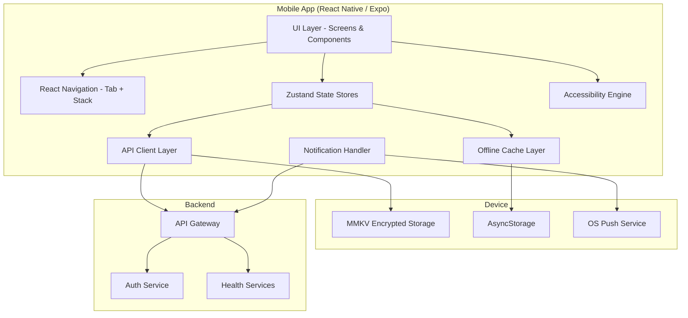
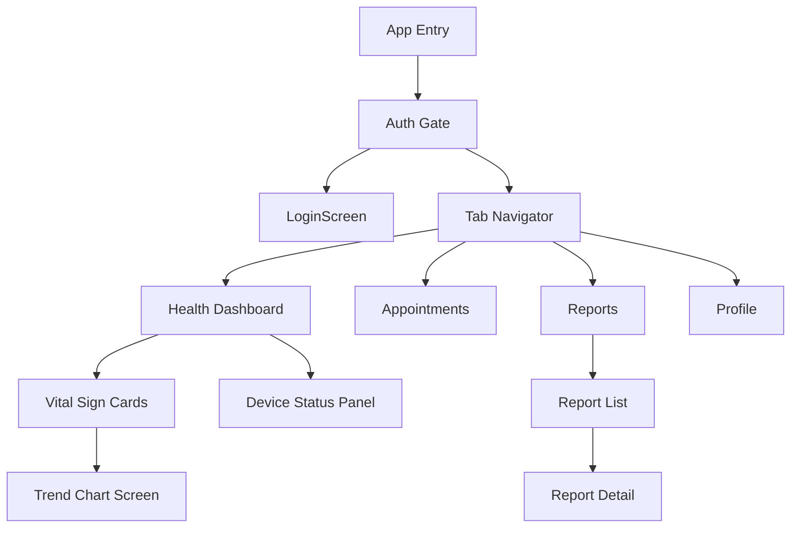

# Design Document: Mobile Health App

## Overview

The Mobile Health App is a React Native / Expo cross-platform mobile application that extends the Senior Citizen Health Checkup System to iOS and Android devices. It connects to the existing Backend API (`https://bsmd-health-checkup-production.up.railway.app`) and reuses the `@health-checkup/shared` package for type definitions.

The app provides senior citizens and caregivers with mobile access to:
- Health readings dashboard with vital sign cards
- Device sync status monitoring
- Trend chart visualizations over configurable time periods
- Push notifications for critical health alerts
- Appointment viewing
- Health reports and follow-up actions
- Profile management
- Offline viewing of cached data

Accessibility is a primary design driver: the app enforces large touch targets (48×48dp), minimum 18sp body text, WCAG 2.1 AA contrast ratios, screen reader compatibility, dynamic text scaling to 200%, and an optional voice assistance mode.

### Key Design Decisions

| Decision | Choice | Rationale |
|----------|--------|-----------|
| Framework | React Native + Expo managed workflow | Single codebase for iOS and Android; Expo simplifies build/deploy |
| Navigation | React Navigation (bottom tab + stack) | Industry standard for RN; supports platform-specific patterns |
| State management | Zustand | Lightweight, TypeScript-first, no boilerplate; fits mobile perf needs |
| HTTP client | Axios with interceptors | Mature, supports request/response interceptors for JWT refresh |
| Offline storage | AsyncStorage + MMKV for secure tokens | AsyncStorage for cache, MMKV for encrypted token storage |
| Charts | react-native-chart-kit or Victory Native | Accessible chart rendering with customizable colors |
| Push notifications | expo-notifications | Cross-platform push token registration, handles foreground/background |
| Testing | Jest + fast-check (property-based) | Matches existing monorepo tooling; fast-check already a dependency |

## Architecture



### Layer Responsibilities

1. **UI Layer**: React Native screens and reusable components. Renders data from Zustand stores. All components accept accessibility props.
2. **Navigation**: React Navigation handles tab and stack navigation. Deep linking from push notifications.
3. **State Management (Zustand)**: Stores for auth, health readings, devices, appointments, reports, profile, and notifications. Keeps UI and data fetching separate.
4. **API Client**: Axios instance with interceptors for JWT injection, 401 token refresh, timeout handling, and offline detection. Central request/response pipeline.
5. **Offline Cache**: Reads/writes to AsyncStorage. Caches API responses with TTL metadata. Serves cached data when offline.
6. **Notification Handler**: Registers push tokens via expo-notifications, handles foreground/background notification display, deep links on tap.
7. **Accessibility Engine**: Enforces minimum touch targets, text sizes, contrast themes, screen reader labels, and optional voice announcements.

## Components and Interfaces

### Screen Components

```
screens/
├── auth/
│   └── LoginScreen.tsx
├── dashboard/
│   └── HealthDashboardScreen.tsx
├── trends/
│   └── TrendChartScreen.tsx
├── devices/
│   └── DeviceStatusScreen.tsx
├── appointments/
│   └── AppointmentScreen.tsx
├── reports/
│   ├── ReportListScreen.tsx
│   └── ReportDetailScreen.tsx
├── profile/
│   └── ProfileScreen.tsx
└── settings/
    └── NotificationSettingsScreen.tsx
```

### Core Module Interfaces

```typescript
// API Client Interface
interface APIClient {
  get<T>(path: string, params?: Record<string, string>): Promise<APIResponse<T>>;
  post<T>(path: string, body?: unknown): Promise<APIResponse<T>>;
  put<T>(path: string, body?: unknown): Promise<APIResponse<T>>;
  delete<T>(path: string): Promise<APIResponse<T>>;
}

interface APIResponse<T> {
  data: T;
  meta?: { page: number; pageSize: number; total: number };
}

// Auth Store Interface
interface AuthState {
  isAuthenticated: boolean;
  accessToken: string | null;
  refreshToken: string | null;
  user: AuthUser | null;
  login(email: string, password: string): Promise<void>;
  logout(): Promise<void>;
  refreshAccessToken(): Promise<boolean>;
  restoreSession(): Promise<void>;
}

interface AuthUser {
  userId: string;
  role: 'Senior_Citizen' | 'Caregiver' | 'Physician';
  seniorId: string;
}

// Health Readings Store Interface
interface HealthReadingsState {
  dailyRecord: DailyHealthRecord | null;
  isLoading: boolean;
  isOffline: boolean;
  lastFetchedAt: Date | null;
  fetchDailyRecord(seniorId: string, date: string): Promise<void>;
  refreshFromCache(): Promise<void>;
}

// Offline Cache Interface
interface OfflineCache {
  get<T>(key: CacheKey): Promise<CachedEntry<T> | null>;
  set<T>(key: CacheKey, data: T): Promise<void>;
  clear(): Promise<void>;
  purgeStale(maxAgeDays: number): Promise<void>;
  isExpired(entry: CachedEntry<unknown>): boolean;
}

interface CachedEntry<T> {
  data: T;
  cachedAt: number; // epoch ms
  expiresAt: number; // epoch ms (cachedAt + 7 days)
}

type CacheKey =
  | `readings:${string}:${string}` // readings:{seniorId}:{date}
  | `devices:${string}`            // devices:{seniorId}
  | `appointments:${string}`       // appointments:{seniorId}
  | `profile:${string}`            // profile:{seniorId}
  | `reports:${string}`;           // reports:{seniorId}

// Notification Handler Interface
interface NotificationHandler {
  registerPushToken(userId: string): Promise<void>;
  handleForegroundNotification(notification: PushNotification): void;
  handleNotificationTap(notification: PushNotification): void;
  requestPermissions(): Promise<'granted' | 'denied'>;
}

interface PushNotification {
  alertId: string;
  severity: 'critical' | 'warning';
  readingType: string;
  measuredValue: number;
  threshold: number;
  message: string;
}

// Accessibility Engine Interface
interface AccessibilityEngine {
  getMinTouchTarget(): { width: number; height: number }; // 48x48dp
  getTextSize(variant: 'body' | 'heading' | 'caption'): number;
  getTheme(): MobileTheme;
  isVoiceAssistanceEnabled(): boolean;
  announce(message: string, priority: 'polite' | 'assertive'): void;
  getScaleFactor(): number; // 1.0 to 2.0
}
```

### Component Hierarchy



## Data Models

The mobile app reuses type definitions from `@health-checkup/shared` and extends them with mobile-specific models.

### Reused from @health-checkup/shared

| Interface | Usage |
|-----------|-------|
| `HealthProfile` | Profile screen display and editing |
| `Appointment` | Appointment list and detail screens |
| `HealthReport` | Report list and detail screens |
| `FollowUpAction` | Follow-up action items in reports |
| `CriticalAlert` | Push notification payload mapping |
| `Notification` | Notification history |
| `AccessibilityPreferences` | Accessibility settings sync |
| `CheckupPackage` | Package info on profile/appointment |

### Mobile-Specific Models

```typescript
// Daily health record as returned by Backend API
interface DailyHealthRecord {
  seniorId: string;
  date: string; // ISO date
  readings: VitalReading[];
  alerts: HealthAlert[];
}

interface VitalReading {
  type: ReadingType;
  value: number;
  secondaryValue?: number; // diastolic for blood pressure
  unit: string;
  timestamp: string; // ISO datetime
  trend: 'improving' | 'stable' | 'declining';
  status: 'normal' | 'borderline' | 'critical';
}

type ReadingType = 'blood_pressure' | 'heart_rate' | 'blood_glucose' | 'spo2' | 'temperature' | 'weight';

interface HealthAlert {
  id: string;
  severity: 'warning' | 'critical';
  readingType: ReadingType;
  message: string;
  createdAt: string;
}

// Device status model
interface DeviceStatus {
  deviceId: string;
  deviceType: string;
  serialNumber: string;
  connectionProtocol: 'bluetooth' | 'wifi' | 'usb';
  isActive: boolean;
  lastSyncAt: string | null; // ISO datetime
  syncStatus: 'synced' | 'stale' | 'inactive';
}

// Trend data for charts
interface TrendData {
  readingType: ReadingType;
  period: '24h' | '7d' | '30d';
  dataPoints: TrendPoint[];
  statistics: TrendStatistics;
  thresholds: TrendThresholds;
}

interface TrendPoint {
  timestamp: string;
  value: number;
  secondaryValue?: number;
}

interface TrendStatistics {
  mean: number;
  min: number;
  max: number;
  count: number;
}

interface TrendThresholds {
  normalMin: number;
  normalMax: number;
  borderlineMin: number;
  borderlineMax: number;
}

// Notification settings
interface NotificationSettings {
  criticalEnabled: boolean;
  warningEnabled: boolean;
  pushToken: string | null;
  permissionStatus: 'granted' | 'denied' | 'undetermined';
}

// Offline state metadata
interface OfflineMetadata {
  isOnline: boolean;
  lastSyncAt: number | null; // epoch ms
  pendingRequests: number;
}
```

### API Endpoint Mapping

| Screen | Endpoint | Method |
|--------|----------|--------|
| Login | `/auth/login` | POST |
| Token Refresh | `/auth/refresh` | POST |
| Daily Readings | `/device-readings/seniors/:seniorId/daily/:date` | GET |
| Device List | `/device-readings/devices/senior/:seniorId` | GET |
| Trends | `/device-readings/seniors/:seniorId/trends/:readingType` | GET |
| Alerts | `/device-readings/seniors/:seniorId/alerts` | GET |
| Appointments | `/scheduling/seniors/:seniorId/appointments` | GET |
| Reports | `/reports/seniors/:seniorId` | GET |
| Profile | `/registration/seniors/:seniorId` | GET |
| Profile Update | `/registration/seniors/:seniorId` | PUT |
| Push Token Register | `/notifications/push-token` | POST |
| Notification Prefs | `/notifications/preferences` | GET/PUT |

