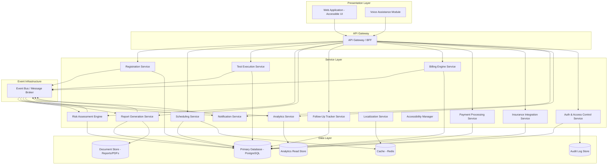
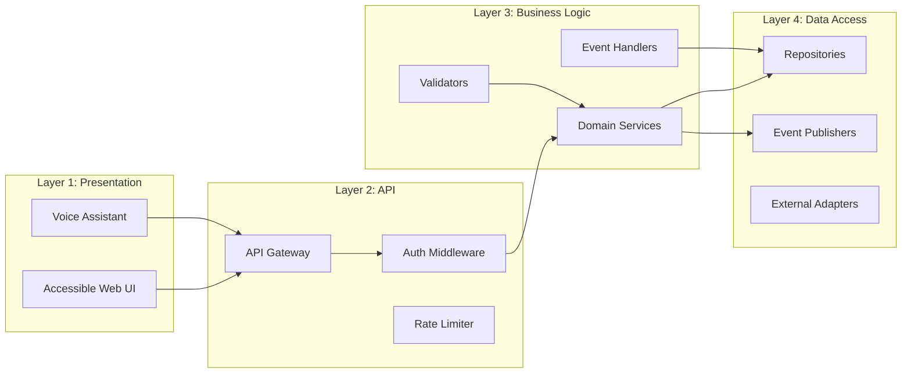
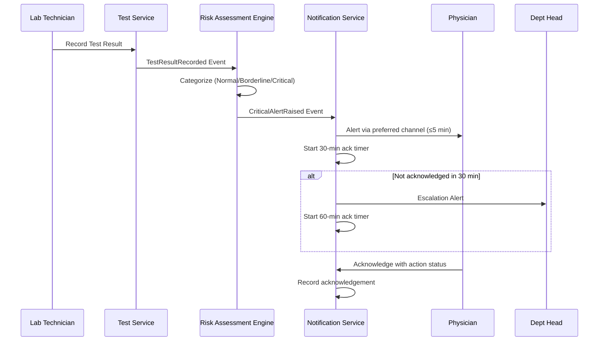
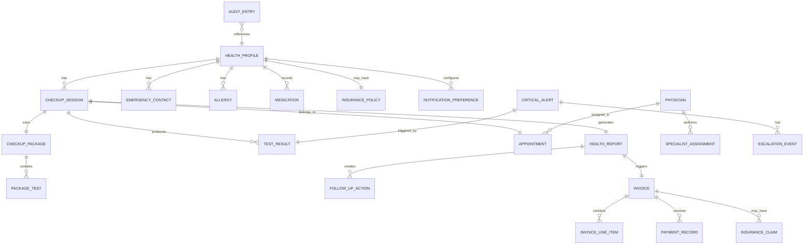

# Design Document: Senior Citizen Health Checkup System

## Overview

The Senior Citizen Health Checkup System is a full-stack healthcare application that manages end-to-end health checkup workflows for individuals aged 60 and above. The system covers patient registration, health screening scheduling, test management, doctor/specialist assignment, report generation, risk assessment, follow-up recommendations, billing and payment processing, multi-language support, accessibility compliance, and comprehensive reporting and analytics dashboards.

The architecture follows a modular, layered design with clear separation between presentation, business logic, and data access layers. The system is designed to be secure (HIPAA-compliant patterns), accessible (WCAG 2.1 AA), and internationalized (10+ languages with RTL support).

### Key Design Decisions

1. **Microservice-oriented architecture** — Each major domain (Registration, Scheduling, Testing, Billing, Analytics, Notifications) is a bounded context with its own service, enabling independent scaling and deployment.
2. **Event-driven communication** — Services communicate via an event bus for asynchronous workflows (alerts, report generation, notifications), ensuring loose coupling and reliability.
3. **CQRS for analytics** — Separate read models for the Analytics Dashboard to handle complex aggregations without impacting transactional workloads.
4. **Localization as a cross-cutting concern** — A dedicated Localization Service that all other services call for content translation, rather than embedding translations in each service.
5. **Accessibility-first UI** — The frontend is built with accessibility as a core requirement, not an afterthought, with semantic HTML, ARIA, keyboard navigation, and voice assistance baked in.

## Architecture

### High-Level Architecture Diagram



### Layered Architecture



### Event Flow for Critical Alerts



## Components and Interfaces

### 1. Registration Service

**Responsibility:** Manages senior citizen registration, health profile CRUD, duplicate detection, and profile validation.

**Interface:**
```typescript
interface RegistrationService {
  registerSeniorCitizen(data: RegistrationRequest): Promise<HealthProfile>;
  updateHealthProfile(id: string, data: ProfileUpdateRequest, userId: string): Promise<HealthProfile>;
  getHealthProfile(id: string): Promise<HealthProfile>;
  checkDuplicate(fullName: string, dateOfBirth: Date): Promise<DuplicateCheckResult>;
  validateAge(dateOfBirth: Date): ValidationResult;
}

interface RegistrationRequest {
  fullName: string;
  dateOfBirth: Date;
  gender: Gender;
  address: Address;
  phoneNumber: string;
  medicalHistory: MedicalHistoryEntry[];
  currentMedications: Medication[];
  allergies: Allergy[];
  emergencyContacts: EmergencyContact[]; // min 1
  preferredLanguage: SupportedLanguage;
  accessibilityPreferences: AccessibilityPreferences;
  insuranceDetails?: InsuranceDetails;
}
```

### 2. Scheduling Service

**Responsibility:** Manages appointment scheduling, time slot availability, reminders, missed appointment handling, and waiting lists.

**Interface:**
```typescript
interface SchedulingService {
  getAvailableSlots(dateRange: DateRange, physicianId?: string): Promise<TimeSlot[]>;
  bookAppointment(request: AppointmentRequest): Promise<Appointment>;
  cancelAppointment(appointmentId: string): Promise<RescheduleOptions>;
  rescheduleAppointment(appointmentId: string, newSlotId: string): Promise<Appointment>;
  markMissed(appointmentId: string): Promise<void>;
  joinWaitingList(seniorId: string, preferences: WaitlistPreferences): Promise<WaitlistEntry>;
  getAvailablePhysicians(date: Date, specialization?: string): Promise<Physician[]>;
}
```

### 3. Test Execution Service

**Responsibility:** Records test results, validates plausible ranges, manages checkup session states, and handles result amendments.

**Interface:**
```typescript
interface TestExecutionService {
  recordTestResult(request: TestResultRequest): Promise<TestResult>;
  amendTestResult(testResultId: string, newValue: MeasuredValue, technicianId: string): Promise<TestResult>;
  getTestResults(checkupSessionId: string): Promise<TestResult[]>;
  getTestHistory(seniorId: string, testType?: string): Promise<TestResult[]>;
  validatePlausibleRange(testType: string, value: number): PlausibleRangeResult;
  completeCheckupSession(sessionId: string): Promise<CheckupSession>;
}

interface TestResultRequest {
  checkupSessionId: string;
  testType: string;
  measuredValue: number;
  unit: string;
  collectionTimestamp: Date;
  technicianId: string;
  confirmOutOfRange?: boolean; // required if value is outside plausible range
}
```

### 4. Risk Assessment Engine

**Responsibility:** Analyzes test results against age-adjusted reference ranges, categorizes results, computes health scores, and detects deterioration trends.

**Interface:**
```typescript
interface RiskAssessmentEngine {
  categorizeResult(testResult: TestResult, ageGroup: AgeGroup): RiskCategory;
  computeHealthScore(sessionResults: TestResult[], ageGroup: AgeGroup): HealthScore;
  detectDeterioration(currentResults: TestResult[], previousResults: TestResult[], ageGroup: AgeGroup): DeteriorationFlag[];
  getAgeAdjustedRange(testType: string, ageGroup: AgeGroup): ReferenceRange | null;
}

interface HealthScore {
  score: number; // 0-100
  breakdown: ScoreBreakdown[];
  normalCount: number;
  borderlineCount: number;
  criticalCount: number;
}
```

### 5. Report Generation Service

**Responsibility:** Generates comprehensive health reports in clinical and simplified formats, supports PDF export, and manages report lifecycle.

**Interface:**
```typescript
interface ReportGenerationService {
  generateReport(sessionId: string): Promise<HealthReport>;
  regenerateReport(reportId: string): Promise<HealthReport>;
  getReport(reportId: string, format: 'clinical' | 'simplified'): Promise<HealthReport>;
  downloadReportPDF(reportId: string, format: 'clinical' | 'simplified'): Promise<Buffer>;
  getReportHistory(seniorId: string): Promise<HealthReportSummary[]>;
}
```

### 6. Follow-Up Tracker Service

**Responsibility:** Manages follow-up action assignments, reminders, escalations, and compliance tracking.

**Interface:**
```typescript
interface FollowUpTrackerService {
  assignFollowUp(request: FollowUpAssignmentRequest): Promise<FollowUpAction>;
  completeFollowUp(actionId: string, notes?: string): Promise<FollowUpAction>;
  getDashboard(seniorId: string): Promise<FollowUpDashboard>;
  getOverdueActions(physicianId: string): Promise<FollowUpAction[]>;
}

interface FollowUpAssignmentRequest {
  reportId: string;
  description: string; // 1-500 chars
  actionType: 'specialist_referral' | 'medication_change' | 'lifestyle_recommendation' | 'next_checkup_date';
  dueDate: Date; // must be in the future
  assigneeNote?: string; // up to 300 chars
}
```

### 7. Billing Engine Service

**Responsibility:** Generates invoices, applies discounts and insurance coverage, manages payment status, and handles refunds.

**Interface:**
```typescript
interface BillingEngineService {
  generateInvoice(sessionId: string): Promise<Invoice>;
  finalizeInvoice(invoiceId: string): Promise<Invoice>;
  applyPayment(invoiceId: string, payment: PaymentRecord): Promise<Invoice>;
  processRefund(invoiceId: string, amount: number): Promise<RefundRecord>;
  getInvoice(invoiceId: string): Promise<Invoice>;
  downloadInvoicePDF(invoiceId: string): Promise<Buffer>;
}
```

### 8. Payment Processing Service

**Responsibility:** Processes payments via multiple methods, manages payment sessions, installment plans, and retries.

**Interface:**
```typescript
interface PaymentProcessingService {
  initiatePayment(request: PaymentRequest): Promise<PaymentSession>;
  processPayment(sessionId: string, details: PaymentDetails): Promise<PaymentResult>;
  retryPayment(sessionId: string, details?: PaymentDetails): Promise<PaymentResult>;
  setupInstallmentPlan(invoiceId: string, installments: number): Promise<InstallmentPlan>;
  expireSession(sessionId: string): Promise<void>;
}

interface PaymentRequest {
  invoiceId: string;
  amount: number;
  method: 'credit_card' | 'debit_card' | 'bank_transfer' | 'digital_wallet';
}
```

### 9. Insurance Integration Service

**Responsibility:** Manages insurance policy details, calculates coverage, submits claims, and tracks claim status.

**Interface:**
```typescript
interface InsuranceIntegrationService {
  recordInsuranceDetails(seniorId: string, details: InsuranceDetails): Promise<InsurancePolicy>;
  calculateCoverage(invoiceId: string, policyId: string): Promise<CoverageCalculation>;
  submitClaim(request: ClaimSubmissionRequest): Promise<InsuranceClaim>;
  getClaimStatus(claimId: string): Promise<ClaimStatus>;
  processClaimApproval(claimId: string, approvedAmount: number): Promise<void>;
  processClaimRejection(claimId: string, reason: string): Promise<void>;
}
```

### 10. Notification Service

**Responsibility:** Delivers notifications via multiple channels, manages preferences, handles fallback delivery, and critical alert escalation.

**Interface:**
```typescript
interface NotificationService {
  sendNotification(request: NotificationRequest): Promise<DeliveryResult>;
  sendCriticalAlert(request: CriticalAlertRequest): Promise<DeliveryResult>;
  acknowledgeCriticalAlert(alertId: string, responderId: string, actionStatus: string): Promise<void>;
  escalateAlert(alertId: string, escalationLevel: EscalationLevel): Promise<void>;
  configurePreferences(userId: string, preferences: NotificationPreferences): Promise<void>;
  getDeliveryLog(alertId: string): Promise<DeliveryLogEntry[]>;
}
```

### 11. Analytics Service

**Responsibility:** Aggregates health data, generates trend lines, computes benchmarks, and provides dashboards for patients, physicians, and administrators.

**Interface:**
```typescript
interface AnalyticsService {
  getPatientTrends(seniorId: string, filters: TrendFilters): Promise<PatientTrends>;
  getPatientSummaryCard(seniorId: string): Promise<SummaryCard>;
  getPhysicianDashboard(physicianId: string): Promise<PhysicianDashboard>;
  getAdminDashboard(filters: AdminFilters): Promise<AdminDashboard>;
  exportData(request: ExportRequest): Promise<Buffer>;
  scheduleAutomatedReport(schedule: ReportSchedule): Promise<void>;
  getBenchmarks(ageGroup: AgeGroup, testType: string): Promise<Benchmark | null>;
}
```

### 12. Localization Service

**Responsibility:** Translates UI content, notifications, and reports; handles locale-specific formatting; manages RTL layouts.

**Interface:**
```typescript
interface LocalizationService {
  translate(key: string, language: SupportedLanguage, params?: Record<string, string>): string;
  translateMedicalTerm(term: string, language: SupportedLanguage): TranslatedMedicalContent;
  formatDate(date: Date, locale: Locale): string;
  formatCurrency(amount: number, currency: Currency, locale: Locale): string;
  formatNumber(value: number, locale: Locale): string;
  isRTL(language: SupportedLanguage): boolean;
  getAvailableLanguages(): SupportedLanguage[];
}
```

### 13. Accessibility Manager

**Responsibility:** Manages accessibility settings, voice input/output, simplified navigation, and WCAG compliance configuration.

**Interface:**
```typescript
interface AccessibilityManager {
  getAccessibilitySettings(userId: string): Promise<AccessibilitySettings>;
  updateAccessibilitySettings(userId: string, settings: AccessibilitySettings): Promise<void>;
  processVoiceCommand(audioInput: Buffer, userId: string): Promise<VoiceCommandResult>;
  generateAudioFeedback(message: string, language: SupportedLanguage): Promise<Buffer>;
  getSimplifiedNavigation(): NavigationConfig;
}
```

### 14. Auth & Access Control Service

**Responsibility:** Authentication, session management, role-based access control, account lockout, and audit logging.

**Interface:**
```typescript
interface AuthService {
  authenticate(credentials: Credentials): Promise<AuthToken>;
  authorize(token: AuthToken, resource: string, action: string): Promise<boolean>;
  lockAccount(userId: string, reason: string): Promise<void>;
  terminateSession(sessionId: string): Promise<void>;
  recordAuditEntry(entry: AuditEntry): Promise<void>;
  getAuditLog(filters: AuditFilters): Promise<AuditEntry[]>;
}
```

## Data Models

### Core Entities

```typescript
// Senior Citizen / Health Profile
interface HealthProfile {
  id: string; // system-generated, immutable
  fullName: string;
  dateOfBirth: Date;
  gender: Gender;
  address: Address;
  phoneNumber: string;
  medicalHistory: MedicalHistoryEntry[];
  currentMedications: Medication[];
  allergies: Allergy[];
  emergencyContacts: EmergencyContact[]; // min 1
  preferredLanguage: SupportedLanguage;
  accessibilityPreferences: AccessibilityPreferences;
  insuranceDetails?: InsurancePolicy;
  createdAt: Date;
  updatedAt: Date;
}

interface EmergencyContact {
  name: string;
  relationship: string;
  phoneNumber: string;
}

interface Allergy {
  substance: string;
  severity: 'mild' | 'moderate' | 'severe';
  notes?: string;
}

interface MedicalHistoryEntry {
  condition: string;
  diagnosedDate?: Date;
  status: 'active' | 'resolved';
  notes?: string;
}

interface Medication {
  name: string;
  dosage: string;
  frequency: string;
  startDate: Date;
  endDate?: Date;
}

// Checkup Package
interface CheckupPackage {
  id: string;
  name: string;
  tier: 'Basic' | 'Standard' | 'Comprehensive' | 'Custom';
  tests: PackageTest[];
  totalCost: number;
  discountRate?: number; // 0-100
  isActive: boolean;
  createdAt: Date;
  updatedAt: Date;
}

interface PackageTest {
  testType: string;
  name: string;
  category: TestCategory;
  cost: number;
  contraindications: string[];
  plausibleRange: { min: number; max: number };
  unit: string;
}

type TestCategory = 'cardiac' | 'vision' | 'hearing' | 'musculoskeletal' | 'blood' | 'urine' | 'imaging' | 'cognitive' | 'endocrine' | 'organ_function';

// Appointment
interface Appointment {
  id: string;
  seniorId: string;
  physicianId: string;
  packageId: string;
  scheduledDate: Date;
  timeSlot: TimeSlot;
  status: 'scheduled' | 'checked_in' | 'in_progress' | 'completed' | 'missed' | 'cancelled';
  createdAt: Date;
  updatedAt: Date;
}

interface TimeSlot {
  id: string;
  startTime: Date;
  endTime: Date;
  physicianId: string;
  isAvailable: boolean;
}

// Checkup Session
interface CheckupSession {
  id: string;
  appointmentId: string;
  seniorId: string;
  packageId: string;
  assignedPhysicianId: string;
  assignedSpecialists: SpecialistAssignment[];
  status: 'in_progress' | 'complete' | 'pending_results';
  startedAt: Date;
  completedAt?: Date;
}

interface SpecialistAssignment {
  specialistId: string;
  specialization: string;
  testCategories: TestCategory[];
}

// Test Result
interface TestResult {
  id: string;
  checkupSessionId: string;
  seniorId: string;
  testType: string;
  measuredValue: number;
  unit: string;
  collectionTimestamp: Date;
  technicianId: string;
  riskCategory?: RiskCategory;
  ageAdjustedRange?: ReferenceRange;
  amendmentHistory: Amendment[];
  createdAt: Date;
}

interface Amendment {
  previousValue: number;
  newValue: number;
  amendedBy: string;
  amendedAt: Date;
  reason?: string;
}

interface ReferenceRange {
  min: number;
  max: number;
  borderlineLow: number;
  borderlineHigh: number;
  criticalLow: number;
  criticalHigh: number;
  ageGroup: AgeGroup;
}

type RiskCategory = 'Normal' | 'Borderline' | 'Critical' | 'Uncategorized';
type AgeGroup = '60-69' | '70-79' | '80-89' | '90+';

// Health Report
interface HealthReport {
  id: string;
  checkupSessionId: string;
  seniorId: string;
  healthScore: HealthScore;
  testResults: CategorizedTestResult[];
  criticalFindings: CriticalFinding[];
  physicianRecommendations: string[];
  trendData?: TrendDataPoint[];
  pendingTests: string[];
  generatedAt: Date;
  regeneratedAt?: Date;
  language: SupportedLanguage;
  versions: {
    clinical: ReportContent;
    simplified: ReportContent;
  };
}

interface CategorizedTestResult {
  testResult: TestResult;
  category: RiskCategory;
  interpretation: string;
}

interface CriticalFinding {
  testType: string;
  measuredValue: number;
  referenceRange: ReferenceRange;
  urgency: 'immediate' | 'urgent';
}

// Follow-Up Action
interface FollowUpAction {
  id: string;
  reportId: string;
  seniorId: string;
  description: string; // 1-500 chars
  actionType: 'specialist_referral' | 'medication_change' | 'lifestyle_recommendation' | 'next_checkup_date';
  dueDate: Date;
  assigneeNote?: string; // up to 300 chars
  status: 'pending' | 'completed' | 'overdue' | 'expired';
  assignedDate: Date;
  completionDate?: Date;
  completionNotes?: string; // up to 1000 chars
  assignedPhysicianId: string;
}

// Invoice
interface Invoice {
  id: string;
  invoiceNumber: string; // unique
  checkupSessionId: string;
  seniorId: string;
  lineItems: InvoiceLineItem[];
  subtotal: number;
  discountRate: number;
  discountAmount: number;
  taxAmount: number;
  insuranceCoveredAmount: number;
  advancePayments: number;
  totalAmountDue: number; // 0.00 to 999,999,999.99
  outstandingBalance: number;
  paymentStatus: 'Unpaid' | 'Partially Paid' | 'Paid in Full';
  language: SupportedLanguage;
  createdAt: Date;
  finalizedAt?: Date;
}

interface InvoiceLineItem {
  testType: string;
  testName: string;
  cost: number;
  discountApplied: number;
  taxApplied: number;
  netAmount: number;
}

// Payment
interface PaymentRecord {
  id: string;
  invoiceId: string;
  amount: number;
  method: PaymentMethod;
  status: 'pending' | 'success' | 'failed' | 'refunded';
  transactionId?: string;
  failureReason?: string;
  processedAt?: Date;
  createdAt: Date;
}

type PaymentMethod = 'credit_card' | 'debit_card' | 'bank_transfer' | 'digital_wallet';

interface InstallmentPlan {
  id: string;
  invoiceId: string;
  totalAmount: number;
  installmentCount: number; // up to 3
  installments: Installment[];
}

interface Installment {
  number: number;
  amount: number;
  dueDate: Date;
  status: 'pending' | 'paid' | 'overdue';
  paymentId?: string;
}

// Insurance Claim
interface InsuranceClaim {
  id: string;
  invoiceId: string;
  seniorId: string;
  policyNumber: string;
  insuranceProvider: string;
  claimedAmount: number;
  approvedAmount?: number;
  status: 'submitted' | 'pending' | 'approved' | 'rejected';
  rejectionReason?: string;
  submissionReference: string;
  submittedAt: Date;
  lastStatusUpdate: Date;
}

interface InsurancePolicy {
  id: string;
  seniorId: string;
  provider: string;
  policyNumber: string;
  coveragePercentage: number; // 0-100
  maxClaimableAmount: number;
  validUntil: Date;
}

// Notification
interface Notification {
  id: string;
  recipientId: string;
  type: NotificationType;
  category: 'critical' | 'appointment' | 'informational';
  content: NotificationContent;
  channels: DeliveryChannel[];
  deliveryStatus: DeliveryStatus[];
  language: SupportedLanguage;
  createdAt: Date;
}

type NotificationType = 'appointment_confirmation' | 'appointment_reminder' | 'critical_alert' | 'report_available' | 'follow_up_reminder' | 'payment_confirmation' | 'escalation';
type DeliveryChannel = 'sms' | 'email' | 'push' | 'phone_call';

interface NotificationPreferences {
  userId: string;
  activeChannels: DeliveryChannel[]; // min 1
  optOutNonCritical: boolean;
  quietHoursStart?: string; // HH:mm
  quietHoursEnd?: string;
}

// Critical Alert
interface CriticalAlert {
  id: string;
  testResultId: string;
  seniorId: string;
  physicianId: string;
  testName: string;
  resultValue: number;
  criticalThreshold: number;
  sentAt: Date;
  acknowledgedAt?: Date;
  acknowledgedBy?: string;
  actionStatus?: string;
  escalationLevel: EscalationLevel;
  escalationHistory: EscalationEvent[];
}

type EscalationLevel = 'physician' | 'department_head' | 'facility_administrator';

interface EscalationEvent {
  level: EscalationLevel;
  escalatedAt: Date;
  acknowledgedAt?: Date;
  acknowledgedBy?: string;
}

// Audit
interface AuditEntry {
  id: string;
  userId: string;
  action: string;
  resourceType: string;
  resourceId: string;
  timestamp: Date;
  details?: Record<string, unknown>;
}

// Physician
interface Physician {
  id: string;
  name: string;
  specialization: string;
  qualifications: string[];
  department: string;
  availabilitySchedule: WeeklySchedule;
  isActive: boolean;
}

// Accessibility
interface AccessibilityPreferences {
  textSize: 'normal' | 'large' | 'extra_large';
  contrastMode: 'default' | 'high_contrast_light' | 'high_contrast_dark';
  voiceAssistance: boolean;
  largeButtonMode: boolean;
  simplifiedNavigation: boolean;
}

// Supported Languages
type SupportedLanguage = 'en' | 'hi' | 'es' | 'zh' | 'ar' | 'fr' | 'pt' | 'bn' | 'ja' | 'de';
```

### Database Schema Overview



## Correctness Properties

*A property is a characteristic or behavior that should hold true across all valid executions of a system — essentially, a formal statement about what the system should do. Properties serve as the bridge between human-readable specifications and machine-verifiable correctness guarantees.*

### Property 1: Registration produces complete Health Profile

*For any* valid registration request with all required fields (full name, date of birth with age ≥ 60, gender, phone number, emergency contact, preferred language, accessibility preferences), the created Health Profile SHALL contain all input data including medical history, medications, allergies, language, and accessibility preferences, with a unique system-generated identifier.

**Validates: Requirements 1.1, 1.4, 1.6**

### Property 2: Registration rejects invalid inputs

*For any* registration request where the date of birth results in age below 60, OR any required field (full name, date of birth, gender, phone number, emergency contact) is missing, the system SHALL reject the registration and correctly identify the validation failure reason.

**Validates: Requirements 1.2, 1.7**

### Property 3: Profile updates produce audit entries

*For any* Health Profile modification, the system SHALL record an audit entry containing the modification timestamp and the identity of the user who made the change, and this entry SHALL be immutable.

**Validates: Requirements 1.3, 18.3**

### Property 4: Duplicate detection identifies matching registrations

*For any* pair of registration attempts with identical full name and date of birth, the system SHALL detect the duplicate and raise a warning displaying the existing profile.

**Validates: Requirements 1.5**

### Property 5: Package test count validation

*For any* custom Checkup Package creation request, the system SHALL accept the package if and only if the test count is between 1 and 50 (inclusive), and SHALL reject with an appropriate error message if outside this range.

**Validates: Requirements 2.2**

### Property 6: Package allergy conflict detection

*For any* combination of a Checkup Package and a Senior Citizen's allergy/contraindication profile, the system SHALL detect and report all tests whose contraindications match recorded allergies, preventing assignment when conflicts exist.

**Validates: Requirements 2.3, 2.4**

### Property 7: Package cost equals sum of test costs

*For any* Checkup Package, the displayed total cost SHALL equal the arithmetic sum of the individual test costs within the package.

**Validates: Requirements 2.6**

### Property 8: Package modifications preserve historical checkup data

*For any* completed checkup session, modifications to the associated Checkup Package (adding, removing, or modifying tests) SHALL NOT alter the stored test results or session data of previously completed checkups.

**Validates: Requirements 2.5**

### Property 9: Appointment slot display constraints

*For any* appointment availability request, the returned time slots SHALL be within the next 30 calendar days, limited to at most 20 per day, and sorted by earliest start time.

**Validates: Requirements 3.1**

### Property 10: Appointment reminder date calculation

*For any* scheduled appointment date and Senior Citizen timezone, the system SHALL compute reminder notifications for exactly 7 days, 2 days, and 1 day before the appointment at 9:00 AM in the Senior Citizen's local timezone.

**Validates: Requirements 3.3**

### Property 11: Cancellation offers rescheduling options

*For any* appointment cancellation where available slots exist, the system SHALL release the original time slot and offer at least 3 rescheduling options within the next 14 calendar days.

**Validates: Requirements 3.4**

### Property 12: Physician assignment follows preference with fallback

*For any* checkup session initiation, the system SHALL assign the Senior Citizen's most recently preferred Physician if available on the selected date, otherwise SHALL assign the next available Physician of the same specialization.

**Validates: Requirements 4.1**

### Property 13: Specialist assignment matches test category

*For any* specialized test in a Checkup Package, the assigned specialist's registered specialization SHALL match the test category (cardiologist for cardiac, ophthalmologist for vision, audiologist for hearing, orthopedist for musculoskeletal).

**Validates: Requirements 4.2**

### Property 14: Test result recording guards

*For any* test result recording attempt, the system SHALL accept the result if and only if the checkup session is in "in-progress" state AND the test belongs to the assigned Checkup Package for that session.

**Validates: Requirements 5.1**

### Property 15: Plausible range validation

*For any* test result value and its configured plausible range, the system SHALL accept values within the range without additional confirmation, and SHALL require explicit confirmation for values outside the range before saving.

**Validates: Requirements 5.2, 5.3**

### Property 16: Session completion detection

*For any* checkup session where the count of recorded test results equals the count of tests in the assigned Checkup Package, the system SHALL transition the session status to "complete."

**Validates: Requirements 5.4**

### Property 17: Age-adjusted reference range attachment

*For any* recorded test result, the system SHALL attach the age-adjusted reference range corresponding to the Senior Citizen's age group alongside the measured value.

**Validates: Requirements 5.6**

### Property 18: Test result amendment preserves history

*For any* amendment to an existing test result in the same session, the system SHALL record both the original and updated values with their respective timestamps.

**Validates: Requirements 5.8**

### Property 19: Risk categorization correctness

*For any* test result value and age-adjusted reference range, the Risk Assessment Engine SHALL categorize the result as: Normal if within normal thresholds, Borderline if within borderline thresholds but outside normal, Critical if beyond critical thresholds, and Uncategorized if no reference range is defined for the age group.

**Validates: Requirements 6.1, 6.5**

### Property 20: Health score computation invariants

*For any* set of categorized test results, the computed health score SHALL be in the range 0-100, SHALL equal 100 when all results are Normal, SHALL decrease for each Borderline result, and SHALL decrease by a greater amount for each Critical result than for a Borderline result.

**Validates: Requirements 6.3**

### Property 21: Deterioration detection

*For any* pair of current and previous test results for the same parameter, the system SHALL flag the parameter as deteriorated if and only if the value has moved further outside its age-adjusted normal range by more than 20% relative to that range.

**Validates: Requirements 6.4**

### Property 22: Report trend chart inclusion rules

*For any* Health Report generation, if the Senior Citizen has fewer than 2 previous checkup sessions, trend charts SHALL be omitted; if 2 or more exist, trend charts SHALL be included comparing up to the 5 most recent sessions.

**Validates: Requirements 7.3, 7.4**

### Property 23: Critical findings report ordering

*For any* Health Report containing critical test results, the critical findings SHALL appear in a dedicated section at the top of the report before all other results.

**Validates: Requirements 7.6**

### Property 24: Partial report generation with pending indicator

*For any* checkup session marked complete with some test results unavailable, the system SHALL generate the report with available results and clearly indicate which tests are pending.

**Validates: Requirements 7.8**

### Property 25: Follow-up action validation

*For any* follow-up action assignment, the system SHALL accept the assignment if and only if: the description is 1-500 characters, the action type is valid, the due date is in the future, and the total actions for the report do not exceed 20. Assignments with past due dates or missing required fields SHALL be rejected.

**Validates: Requirements 8.1, 8.6**

### Property 26: Follow-up action status categorization

*For any* follow-up action, the dashboard SHALL categorize it as: "pending" if due date has not passed and not completed, "completed" if marked complete, "overdue" if due date passed but within 30 days and not completed, and "expired" if more than 30 days past due.

**Validates: Requirements 8.5**

### Property 27: Invoice calculation correctness

*For any* completed checkup session with test costs, discount rates, tax amounts, insurance coverage, and advance payments, the Invoice SHALL compute: line item amounts rounded to 2 decimal places, discount correctly applied per configured rate (0-100%), and total amount due = subtotal - discounts - insurance - advance payments, constrained to 0.00–999,999,999.99.

**Validates: Requirements 9.1, 9.2, 9.4**

### Property 28: Invoice number uniqueness

*For any* two finalized invoices, their invoice numbers SHALL be distinct.

**Validates: Requirements 9.6**

### Property 29: Payment status derivation

*For any* Invoice with a total amount due and payments received, the payment status SHALL be: "Unpaid" if total payments = 0, "Partially Paid" if 0 < total payments < amount due, and "Paid in Full" if total payments ≥ amount due. The outstanding balance SHALL equal amount due minus total payments.

**Validates: Requirements 9.7**

### Property 30: Payment retry limit enforcement

*For any* payment session, the system SHALL allow at most 5 retry attempts after failure, and SHALL reject further attempts after the limit is reached.

**Validates: Requirements 10.4**

### Property 31: Installment plan computation

*For any* Comprehensive Checkup Package invoice with amount ≥ 500 in configured currency, the system SHALL allow division into up to 3 equal monthly installments where the sum of all installments equals the total amount.

**Validates: Requirements 10.5**

### Property 32: Insurance coverage calculation

*For any* invoice amount, coverage percentage, and maximum claimable amount, the insurance-eligible amount SHALL equal the minimum of (invoice amount × coverage percentage) and the maximum claimable amount, with the remainder assigned as patient responsibility.

**Validates: Requirements 11.2, 11.8**

### Property 33: Claim approval reduces invoice balance

*For any* approved insurance claim, the Invoice outstanding balance SHALL be reduced by exactly the approved amount.

**Validates: Requirements 11.5**

### Property 34: Translation completeness

*For any* translatable UI key or notification content and any supported language, the Localization Service SHALL return a translation. If no translation exists for the specific content, it SHALL return English with a visible fallback notification.

**Validates: Requirements 12.2, 12.3, 12.7**

### Property 35: Locale-specific formatting

*For any* date, number, or currency value and any supported locale, the formatting functions SHALL produce output conforming to that locale's conventions (date order, decimal separator, currency symbol placement).

**Validates: Requirements 12.5**

### Property 36: RTL detection

*For any* supported language, the isRTL function SHALL return true for Arabic and false for all other supported languages, and the layout SHALL mirror accordingly.

**Validates: Requirements 12.8**

### Property 37: Role-based access control enforcement

*For any* user role, resource type, and action, the authorization system SHALL permit access if and only if the role's defined permissions include that resource-action combination. Unauthorized attempts SHALL be denied and logged in the audit trail.

**Validates: Requirements 18.1, 18.7**

### Property 38: Account lockout after consecutive failures

*For any* user account, the system SHALL lock the account after exactly 5 consecutive failed authentication attempts, and the lockout SHALL persist for a minimum of 30 minutes.

**Validates: Requirements 18.2**

### Property 39: Critical alert escalation state machine

*For any* critical alert, if not acknowledged by the assigned Physician within 30 minutes, the system SHALL escalate to the department head. If the department head does not acknowledge within 60 minutes of escalation, the system SHALL escalate to the facility administrator.

**Validates: Requirements 19.3, 19.4**

### Property 40: Alert delivery retry and fallback

*For any* critical alert notification where the primary channel fails, the system SHALL retry up to 3 times at 2-minute intervals on the primary channel, and if all retries fail, SHALL attempt delivery via the secondary channel within 1 minute.

**Validates: Requirements 19.7**

### Property 41: Alert acknowledgement validation

*For any* critical alert acknowledgement, the system SHALL require responder identity, timestamp, and action status selection. Acknowledgements missing any of these fields SHALL be rejected.

**Validates: Requirements 19.8**

### Property 42: Notification preference minimum channel

*For any* notification preference configuration, the system SHALL require at least one active delivery channel and SHALL reject configurations with zero channels.

**Validates: Requirements 20.2**

### Property 43: Notification channel fallback ordering

*For any* notification delivery failure on the primary channel, the system SHALL attempt remaining configured channels in preference order, with a maximum of 3 fallback attempts and no more than 5 minutes between attempts.

**Validates: Requirements 20.4**

### Property 44: Non-critical notification opt-out routing

*For any* notification when the Senior Citizen has opted out of non-critical notifications, informational messages SHALL be suppressed while critical alerts and appointment reminders SHALL continue to be delivered.

**Validates: Requirements 20.6**

### Property 45: Analytics trend data point limiting

*For any* Senior Citizen's checkup history with N checkups, the Analytics Dashboard SHALL display at most min(N, 50) data points per health parameter.

**Validates: Requirements 15.1**

### Property 46: Consecutive abnormal parameter warning

*For any* health parameter with results from 3 or more consecutive checkups where the value is outside the normal reference range, the Analytics Dashboard SHALL highlight the parameter with a visual warning indicator.

**Validates: Requirements 15.4**

### Property 47: Physician dashboard percentage invariant

*For any* aggregation of patient results by test type, the sum of Normal, Borderline, and Critical percentages SHALL equal 100% for each test type.

**Validates: Requirements 16.2**

### Property 48: Administrative statistics percentage distribution

*For any* time-period-filtered report on package popularity or language usage, the percentage distribution SHALL sum to 100% and each percentage SHALL correctly represent count/total.

**Validates: Requirements 17.4, 17.6**

### Property 49: Voice command recognition

*For any* input matching the defined voice commands ("next", "back", "home", "appointments", "reports"), the system SHALL correctly identify and execute the command. For any input not matching a defined command, the system SHALL report the command as unrecognized.

**Validates: Requirements 14.4**

### Property 50: Simplified navigation item limit

*For any* navigation configuration in simplified mode, the number of top-level menu items SHALL not exceed 6.

**Validates: Requirements 13.9**

## Error Handling

### Error Handling Strategy

The system employs a layered error handling approach:

1. **Input Validation Errors** (400-level): Returned immediately to the caller with specific field-level error messages. Examples: missing required fields, invalid age, out-of-range values, invalid payment details.

2. **Business Rule Violations** (422-level): Returned when the request is well-formed but violates business constraints. Examples: duplicate registration, package conflict with allergies, exceeded retry limits, past due dates on follow-ups.

3. **Authorization Errors** (403-level): Logged to audit trail and returned with a generic "insufficient permissions" message. No details about what permissions would be needed are exposed.

4. **Service Failures** (500-level): Logged with full context, returned to user with a user-friendly message and retry guidance where applicable.

5. **External Integration Failures**: Handled with retry logic (insurance claims, payment processing, notification delivery) with exponential backoff and fallback channels.

### Specific Error Handling Scenarios

| Scenario | Handling | User Impact |
|----------|----------|-------------|
| Test result save failure | Preserve form data, show error, allow retry | No data loss for technician |
| Payment processing failure | Display reason, suggest fix, allow 5 retries | Can retry or change method |
| Insurance claim submission failure | Retain claim data, allow retry | No re-entry required |
| Invoice generation failure (missing cost) | Block generation, show missing data | No incomplete invoices |
| Notification delivery failure (all channels) | Log failure, show indicator on next login | Aware on next visit |
| Critical alert delivery failure | 3 retries on primary, then secondary channel | Multi-channel redundancy |
| Automated report generation failure | 3 retries at 5-min intervals, then notify admin | Admin alerted |
| Language switch failure | Retain previous language, show error notification | No UX disruption |
| Payment session timeout (10 min) | Expire session, release holds, notify user | Can start new session |
| Authentication failure (5 consecutive) | Lock account 30 min, log event | Must wait or contact admin |

### Resilience Patterns

- **Circuit Breaker**: Applied to external integrations (insurance providers, payment gateways) to prevent cascade failures.
- **Retry with Backoff**: Used for transient failures in notification delivery, claim submission, and report generation.
- **Idempotency Keys**: Payment processing and claim submissions use idempotency keys to prevent duplicate transactions on retry.
- **Dead Letter Queue**: Failed event processing messages are moved to a DLQ for manual review and replay.
- **Graceful Degradation**: If the Analytics service is down, core workflows (registration, testing, billing) continue unaffected.

## Testing Strategy

### Unit Tests

Unit tests cover specific examples, edge cases, and error conditions for each service:

- **Registration Service**: Valid registration, age boundary (exactly 60, 59 years 364 days), duplicate detection, missing field combinations.
- **Scheduling Service**: Slot availability edge cases (full days, no slots), missed appointment threshold (exactly 30 minutes), waiting list behavior.
- **Test Execution Service**: Session state guards, plausible range boundaries, amendment workflow.
- **Risk Assessment Engine**: Boundary values between Normal/Borderline/Critical, undefined reference ranges, deterioration calculation precision.
- **Billing Engine**: Rounding behavior (half-penny cases), zero-discount notation, maximum amount boundary (999,999,999.99).
- **Payment Service**: Card format validation, session timeout at exactly 10 minutes, retry counter at limit.
- **Insurance Service**: Coverage at 0% and 100%, max claimable exactly equal to invoice amount.
- **Notification Service**: Channel fallback with no secondary configured, opt-out filtering by category.
- **Localization Service**: RTL detection, missing translation fallback, locale formatting edge cases.
- **Auth Service**: Lockout at exactly 5 failures, session timeout boundary, role permission matrix coverage.

### Property-Based Tests

Property-based tests validate the correctness properties defined above using a PBT library (e.g., fast-check for TypeScript/JavaScript). Each property test:

- Runs a minimum of 100 iterations with random generated inputs
- References the design document property via a tag comment
- Tag format: **Feature: senior-citizen-health-checkup, Property {number}: {property_text}**

Key generators needed:
- `arbitraryRegistrationRequest` — generates valid/invalid registration data
- `arbitraryCheckupPackage` — generates packages with random test counts and costs
- `arbitraryAllergyProfile` — generates allergy/contraindication profiles
- `arbitraryTestResult` — generates test results with random values
- `arbitraryReferenceRange` — generates age-adjusted reference ranges
- `arbitraryInvoiceLineItems` — generates invoice items with costs, discounts, taxes
- `arbitraryPaymentDetails` — generates valid/invalid payment details
- `arbitraryInsurancePolicy` — generates coverage percentages and max amounts
- `arbitraryNotificationPreferences` — generates channel configurations
- `arbitraryFollowUpAction` — generates follow-up actions with random fields
- `arbitraryRoleResourceAction` — generates role/resource/action combinations

### Integration Tests

Integration tests verify cross-service interactions and external system behavior:

- Appointment booking → confirmation notification delivery
- Test result recording → risk assessment → critical alert delivery
- Checkup completion → report generation → notification
- Invoice generation → payment processing → receipt delivery
- Insurance claim submission → status tracking → balance update
- Language switch → full UI re-render in target language
- Automated report scheduling → email delivery

### End-to-End Tests

Full workflow scenarios:
1. Registration → Package Assignment → Scheduling → Test Execution → Report → Follow-up → Billing → Payment
2. Critical result flow: Test recording → Risk alert → Escalation chain → Acknowledgement
3. Insurance flow: Registration with insurance → Checkup → Invoice → Claim → Approval → Balance update

### Accessibility Testing

- Automated WCAG 2.1 AA audits using axe-core
- Screen reader compatibility testing (NVDA, VoiceOver)
- Keyboard-only navigation walkthrough
- Voice command recognition accuracy testing
- Contrast ratio verification for all theme variants

